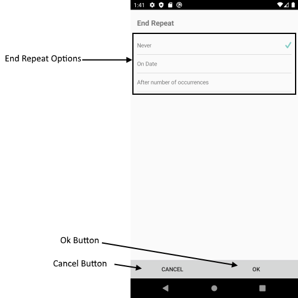

# Scheduling UI - End Repeat Appointment View

Add Appointment View allows the user to change the main appointment properties like `Title`, `Start` and `End Date`, `Detail`, `Recurrence`, whether it will be All Day appointment.

## Visual Structure of End Repeat Appointment View

## Control Template

The control template for the **EndRepeatAppointmentView** can be found at the [following location in our SDKBrowser Application](https://github.com/telerik/xamarin-forms-sdk/blob/master/XamarinSDK/SDKBrowser/SDKBrowser/Examples/CalendarControl/SchedulingCategory/SchedulingUIViews/EndRepeatAppointmentView.xaml).

## Partial Customization Options 

In addition, to avoid editing the whole control template, there are additional properties which you can use to customize the look of the UIs, such as SeparatorThickness, ButtonBackgroundColor, etc.  

* ****(**):
* ****(**):
* ****(**):
* ****(**):
* ****(**):
* ****(**):

>important These properties or the ControlTemplates can be changed by applying styles that target a specific view in the “App.xaml” file of your application. 

## See Also

* [Delete Appointment View]()
* [Color Picker View]()
