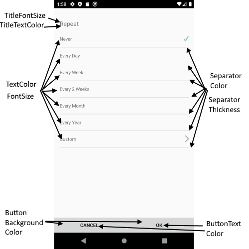

# Repeat Appointment View

RepeatAppointmentView is a view for choosing predefined repeat options like EveryDay, Every Month, Every Year, etc.

## Visual Structure of Repeat Appointment View


## Control Template

> The control template for the **RepeatAppointmentView** can be found at the [following location in our SDKBrowser Application](https://github.com/telerik/xamarin-forms-sdk/blob/master/XamarinSDK/SDKBrowser/SDKBrowser/Examples/CalendarControl/SchedulingCategory/SchedulingUIViews/RepeatAppointmentView.xaml).

## Customization Properties 

In addition, to avoid editing the whole control template, there are additional properties which you can use to customize the look of the UIs, such as SeparatorThickness, ButtonBackgroundColor, etc.  

* **ControlTemplate**(*controlTemplate*): Defines the Control Template of the RepeatAppointmentView.
* **TitleFontSize**(*double*): Defines the font size of the RepeatAppointmentView title.
* **TitleTextColor**(*Xamarin.Forms.Color*): Defines the text color of the RepeatAppointmentView title.
* **FontSize**(*double*): Defines the font size of the repeat appointment options.
* **TextColor**(*Xamarin.Forms.Color*): Defines the text color of the repeat appointment options.
* **SeparatorColor**(*Xamarin.Forms.Color*): Defines the color of the separator (the lines which devide each repeat appointment option).
* **SeparatorThickness**(*Xamarin.Forms.Thickness*): Defines the thickness of the separators (the lines which devide each repeat appointment option).
* **ButtonBackgroundColor**(*Xamarin.Forms.Color*): Defines the background color for the OK and Cancel buttons.
* **ButtonTextColor**(*Xamarin.Forms.Color*): Defines the text color of the OK and Cancel buttons.
* **BackgroundColor**(*Xamarin.Forms.Color*): Defines the background color of the RepeatAppointmentView.

>important These properties or the ControlTemplate can be changed by applying style with TargetType="telerikInput:RepeatAppointmentView" in the  resources of the “App.xaml” file of your application. 

> If you customize the control template using ControlTemplate property, you need to define first the control template then the style in the App.xaml Resources. Also when the control template is defined in the App.xaml resources it will be applied for all RadCalendar controls used in the application. If you want to apply the control template on a concreate calendar control, you will need to merge the resource dictionary to the concreate page where the calendar is defines. Example can be found in out [Telerik Sample Application](https://github.com/telerik/telerik-xamarin-forms-samples/tree/master/QSF/QSF/Examples/CalendarControl/SchedulingUICustomizationExample).  



### Example

```XAML
<Style TargetType="telerikInput:RepeatAppointmentView">
    <Setter Property="TextColor" Value="Red"/>
    <Setter Property="TitleTextColor" Value="Red"/>
    <Setter Property="TitleFontSize" Value="20"/>
	...
</Style>
```

In addition, you will need to add the following namespace: 

<snippet id='xmlns-telerikinput'/>

## See Also

* [Add Appointment View]()
* [Appointment Summery View]()
* [Delete Appointment View]()
* [Color Picker View]()
* [Custom Recurrence View]()
* [End Repeat Appointment View]()
