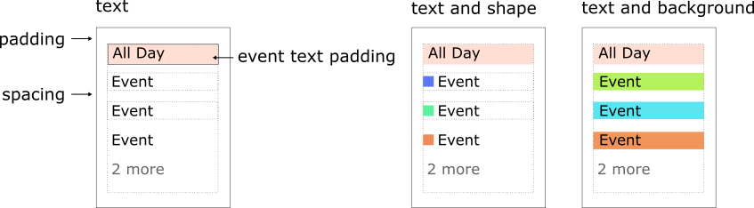
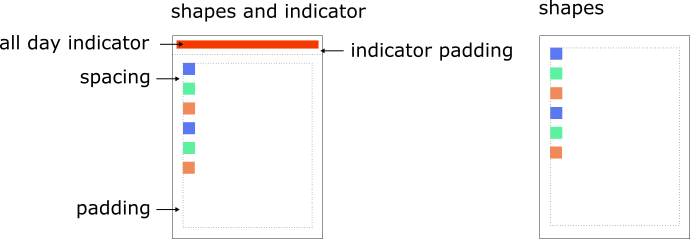
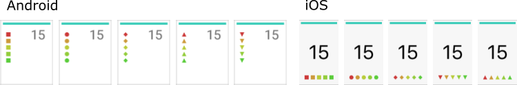
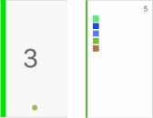
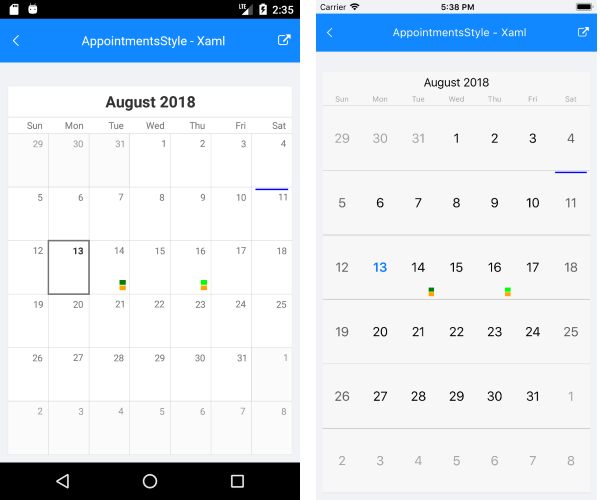

# Appointments Styling

> Appointments can be customized only in **iOS** and **Android**.

This article's purpose is to get users familiar with the **AppointmentsStyle** property of the RadCalendar component. It is of type **CalendarAppointmentsStyle** that exposes number of properties that will help you customize the calendar appointments in the most common scenarios.

## Visual Structure

The events can be rendered as text or shapes or a combination of these. The images below explain the the visual structure and the elements in the different display modes.

### Text Mode

### Shapes Mode

## CalendarAppointmentsStyle Properties

### Common properties
 
- **DisplayMode** (*AppointmentDisplayMode*): Specifies how the appointments are visualized. The possible modes are:
 - Text
 - TextWithShape
 - TextWithBackground
 - Shape
- **MaxCount**: Defines the maximum count of displayed events. 
- **Padding**: Specifies the padding of the rectangle that holds the events.
- **Spacing**: Defines the empty space between two appointments in the same date.

### Text Specific Properties

- **FontSize**: Defines a value controlling the size of the text of an appointment. 
- **TextColor**: Defines the color for all appointments that are **not** marked as all day. This color will be applied if the *TextColorFromAppointment* property is set to false.
- **AllDayTextColor**: Specifies the text color for the all-day appointments. 
- **MoreTextColor**: Defines the color for the text indicating  there are appointments that are not displayed due to lack of space.
- **TextPadding**: Defines the padding of the appointments text.
- **AllDayTextPadding**: Defines the padding of the all-day appointments text. 
- **TextColorFromAppointment**: It is a boolean value indicating whether the appointment text should take its color from the *IAppointment.Color* value or the *TextColor* property value should be used.
- **TextVerticalLocation** (*VerticalLocation*): Defines the vertical position of the text.
- **TextHorizontalLocation** (*HorizontalLocation*): Defines the horizontal position of the text.
- **MoreTextFormatString**: Specifies the format string that will be used to modify the text displaying how many appointments remain hidden, e.g.: " **{0} more**"
- **BackgroundRectBorderRadius**: Defines the border radius of the text background rectangle.

### Shapes Specific Properties

- **ShapeSize** (*Size*): Defines the dimensions that will be user when drawing the separate shapes.
- **ShapesOrientation**: Specifies the orientation of the shapes.
- **ShapeSize** (*Size*): Specifies the size of the events shapes.
- **ShapesVerticalLocation**: Specifies the vertical position of the events shapes.
- **ShapesHorizontalLocation**: Specifies the horizontal position of the events shapes.
- **AllDayShapesDisplayMode** (*AllDayDisplayMode*): Specifies a value defining how the all-day events will be visualized. The available options are:
 - Indicator
 - WithShapes
- **AllDayIndicatorWidth**: Specifies the width of the all-day indicator. It will take all available space for its other dimension depending on its location.
- **AllDayIndicatorPadding** (*Thickness*): Sets the padding of the all-day indicator rectangle. 
- **ShapeType** (*CalendarAppointmentShapeType*): Specifies the shape representing an appointment. The available options are:
 - Rectangle
 - Ellipse
 - TriangleUp
 - TriangleDown
 - Rhombus

    
- **AllDayShapeType** (*CalendarAppointmentShapeType*): Defines the shape type of the all-day appointments. If this property is not set, the ShapeType value will be used.
- **AllDayIndicatorLocation** (*Location*): Specifies the location where the all day indicators are visualized.
 - None
 - Top
 - Bottom
 - Left
 - Right

    

- **ReserveIndicatorSpace**: In scenarios where appointments are rendered as shapes with all-day indicator, but there are no all-day events for a specific day. This boolean property specifies whether the shapes will keep the space where the indicator is drawn or they will take all available space. 

## Example

<snippet id='calendar-appointmentsstyle-xaml' />
<snippet id='calendar-appointmentsstyle-csharp' />

Here is the end result:

## See Also

- [Appointments]()
