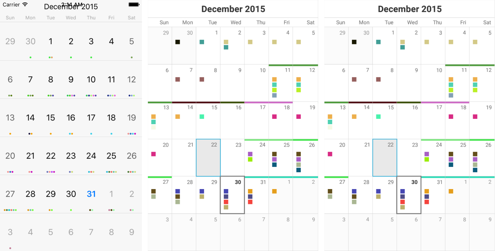
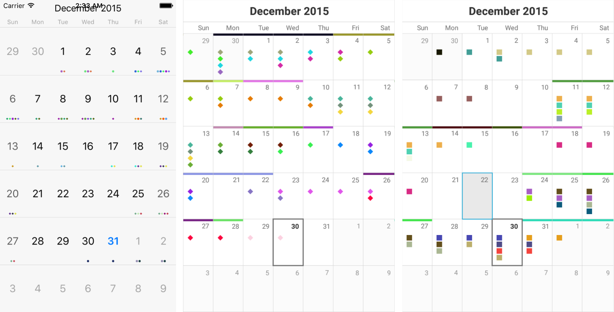
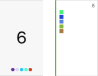

This article's purpose is to get you familiar with the **AppointmentsStyle** property of the RadCalendar component. It is of type **CalendarAppointmentsStyle** and gets or sets the visual representation of the appointments of the calendar. Here are the properties that the style exposes:

 - **FontSize** (*double*): Gets or sets a value controlling the size of the text of an appointment.
 - **ShapeSize** (*Size*): Gets or sets the dimensions that will be user when drawing the separate shapes.
 - **Spacing** (*double*): Gets or sets the empty space between two appointments in the same date.
 - **DisplayMode** (*AppointmentDisplayMode*): Gets or sets how the appointments are visualized.

 - **ShapeType** (*CalendarAppointmentShapeType*): Gets or sets the shape representing an appointment.

 - **AllDayIndicatorLocation** (*Location*): Gets or sets the location where the all day indicators are visualized.
 
