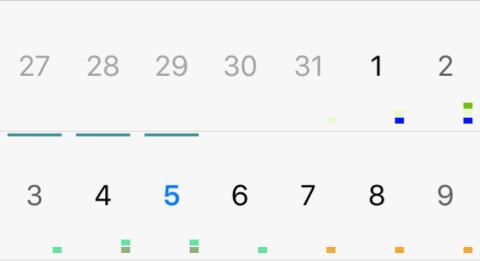

# Appointments Styling

> Appointments can be customized only in **iOS** and **Android**.

This article's purpose is to get users familiar with the **AppointmentsStyle** property of the RadCalendar component. It is of type **CalendarAppointmentsStyle** that exposes number of properties that will help you customize the calendar appointments in the most common scenarios.

## Visual Structure

The events can be rendered as text or shapes or a combination of these. The images below explain the the visual structure and the elements in the different display modes.

### Text Mode

### Shapes Mode

## CalendarAppointmentsStyle Properties

### Common properties
 
- **DisplayMode** (*AppointmentDisplayMode*): Gets or sets how the appointments are visualized. The possible modes are:
 - Text
 - TextWithShape
 - TextWithBackground
 - Shape
- **MaxCount** (*int*): Gets or sets the maximum count of displayed events. 
- **Padding** (*Thickness*): Gets or sets the padding of the rectangle that holds the events.
- **Spacing** (*double*): Gets or sets the empty space between two appointments in the same date.

### Text Specific Properties

- **FontSize** (*double*): Gets or sets a value controlling the size of the text of an appointment. 
- **TextColor** (*Color*): Gets or sets the color for all appointments that are **not** marked as all day. This color will be applied if the *TextColorFromAppointment* property is set to false.
- **AllDayTextColor** (*Color*): Gets or sets the text color for the all-day appointments. 
- **MoreTextColor** (*Color*): Gets or sets the color for the text indicating  there are appointments that are not displayed due to lack of space.
- **TextPadding** (*Thickness*): Gets or sets the padding of the appointments text.
- **AllDayTextPadding** (*Thickness*): Gets or sets the padding of the all-day appointments text. 
- **TextColorFromAppointment** (*bool*): Gets or sets a boolean value indicating whether the appointment text should take its color from the *IAppointment.Color* value or the *TextColor* property value should be used.
- **TextVerticalLocation** (*VerticalLocation*): Gets or sets the vertical position of the text.
- **TextHorizontalLocation** (*HorizontalLocation*): Gets or sets the horizontal position of the text.
- **MoreTextFormatString** (*string*): Gets or sets the format string that will be used to modify the text displaying how many appointments remain hidden, e.g.: " **{0} more**"
- **BackgroundRectBorderRadius** (*double*): Gets or sets the border radius of the text background rectangle.

### Shapes Specific Properties

- **ShapeSize** (*Size*): Gets or sets the dimensions that will be user when drawing the separate shapes.
- **ShapesOrientation** (*Orientation*): Gets or sets the orientation of the shapes.
- **ShapeSize** (*Size*): Gets or sets the size of the events shapes.
- **ShapesVerticalLocation** (*VerticalLocation*): Gets or sets the vertical position of the events shapes.
- **ShapesHorizontalLocation** (*HorizontalLocation*): Gets or sets the horizontal position of the events shapes.
- **AllDayShapesDisplayMode** (*AllDayDisplayMode*): Gets or sets a value defining how the all-day events will be visualized.
 - Indicator
 - WithShapes
- **AllDayIndicatorWidth** (*double*): Gets or sets the width of the all-day indicator. It will take all available space for its other dimension depending on its location.
- **AllDayIndicatorPadding** (*Thickness*): Gets or sets the padding of the all-day indicator rectangle. 
- **ShapeType** (*CalendarAppointmentShapeType*): Gets or sets the shape representing an appointment.
 - Rectangle
 - Ellipse
 - TriangleUp
 - TriangleDown
 - Rhombus

    
- **AllDayShapeType** (*CalendarAppointmentShapeType*): Gets or sets the shape type of the all-day appointments. If this property is not set, the ShapeType value will be used.
- **AllDayIndicatorLocation** (*Location*): Gets or sets the location where the all day indicators are visualized.
 - None
 - Top
 - Bottom
 - Left
 - Right

    

- **ReserveIndicatorSpace** (*bool*): In scenarios where appointments are rendered as shapes with all-day indicator, but there are no all-day events for a specific day. This property specifies whether the shapes will keep the space where the indicator is drawn or they will take all available space. 

## Example

	var r = new Random();
    var appointments = new ObservableCollection<Appointment>();
    for (int i = 0; i < 30; i++)
    {
        var start = DateTime.Now.AddDays(r.Next(-30, 3)).AddHours(r.Next(-12, 12));
        appointments.Add(new Appointment() 
        { 
            Color = Color.FromRgb(r.Next(256), r.Next(256), r.Next(256)),
            StartDate = start,
            EndDate = start.AddDays(r.Next(3)).AddHours(r.Next(24)),
            IsAllDay = r.Next(100) % 3 == 0 ? true : false,
            Title = i + " appointment title"
        });
    }

	this.calendar.AppointmentsSource = appointments;
    this.calendar.AppointmentsStyle = new CalendarAppointmentsStyle
    {
        DisplayMode = AppointmentDisplayMode.Shape,
        Padding = new Thickness(5, 25, 5, 5),
        MaxCount = 20,
        Spacing = 1,
        ShapesHorizontalLocation = HorizontalLocation.Right,
        ShapesVerticalLocation = VerticalLocation.Bottom,
        ShapesOrientation = Orientation.Vertical,
        ShapeSize = new Size(6, 4),
        ShapeType = CalendarAppointmentShapeType.Rectangle,
        AllDayShapesDisplayMode = AllDayDisplayMode.Indicator,
        AllDayIndicatorLocation = Location.Top,
        AllDayIndicatorPadding = new Thickness(5, 2),
        AllDayIndicatorWidth = 2,
    };

The result should be similar to this:

