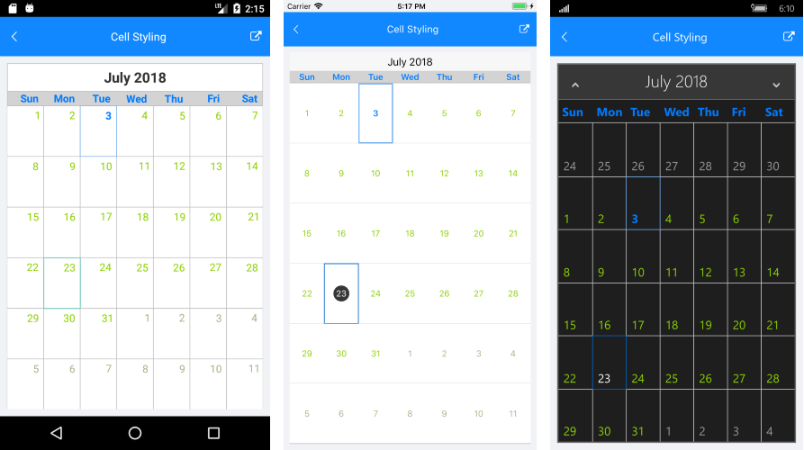

# Cell Styling
 
This article describes the APIs used to customize the look of the calendar cells.

The RadCalendar component exposes a property which enables you to provide a custom style for each cell.

- **SetStyleForCell** (Func&lt;CalendarCell, CalendarCellStyle&gt;): This property should be assigned to a method that provides a **CalendarCellStyle** for each calendar cell.

## CalendarCell types

The **CalendarCell** objects are not actual visual elements, but they provide context that the user can use to style different parts of the calendar. [Here]() you can find more information about the calendar visual structure.

All cells share a common base class - the **CalendarCell**. Here are its properties:

- **Text** (string): Gets the text displayed in the cell.
- **Type** (CalendarCellType): Gets the type of the cell. The possible values are:
 - **Date**: all cells that correspond to actual dates has this type
 - **WeekNumber**: cells that hold week numbers
 - **DayName**: cells that hold the days of the week

Below are described the specific calendar cells and their properties.

### CalendarDateCell

These cells hold date values (days, months, years). The Type of CalendarDateCell is `Date`.

- **IsEnabled** (bool): Gets a value that specifies whether the cell is enabled (inside the calendar MinDate and MaxDate range).
- **IsSelected** (bool): Gets a value that specifies whether the cell is currently selected.
- **Date** (DateTime): Gets the date that corresponds to the cell.

### CalendarDayCell

These cells hold dates in Month and Week view. The CalendarDayCell inherits from CalendarDateCell and its Type is also `Date`. 

- **IsFromCurrentMonth** (bool): Gets a value that specifies whether the cell is from the current month in month view.
- **IsToday** (bool): Gets a value that specifies whether the cell date is today.

### CalendarTextCell

These cells hold elements different from dates: week numbers and week day names and correspondingly have Type `WeekNumber` or `DayName`.

## CalendarCellStyle

The **CalendarCellStyle** class provides the following properties:

 - **BackgroundColor** (Color)
 - **BorderColor** (Color)
 - **BorderThickness** (Thickness)
 - **FontSize** (double)
 - **FontWeight** (FontWeight): Bold or Normal.
 - **ForegroundColor** (Color)

## Example

This example demonstrates how you can apply styles to different calendar cell types.

<snippet id='calendar-features-cellstyling-setstyleforcell'/>

And this is the method:

<snippet id='calendar-features-cellstyling-evaluatecellstyle'/>

Here is the result:

