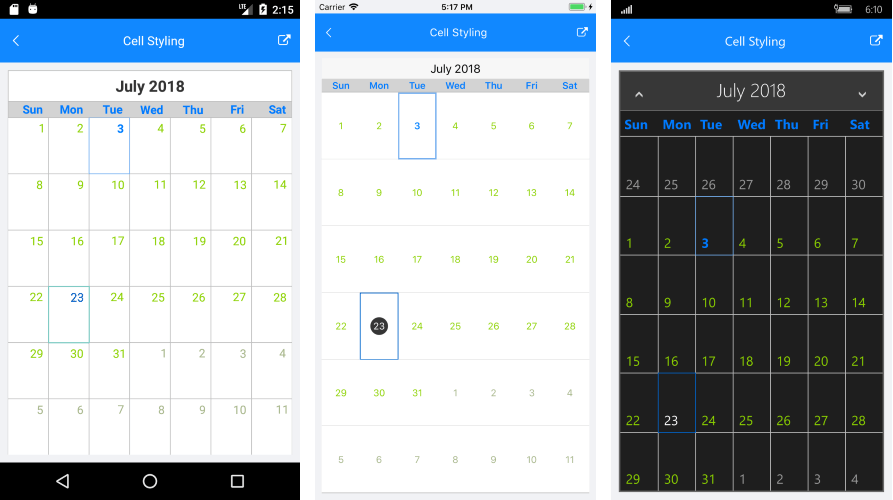

# Cell Styling
 
This article describes the APIs used to customize the look of the calendar cells. The RadCalendar component exposes a property which enables you to provide a custom style for each cell.

- **SetStyleForCell** (Func&lt;CalendarCell, CalendarCellStyle&gt;): This property should be assigned to a method that returns a **CalendarCellStyle** object. The method will be called for each calendar cell and a **CalendarCell** object will be passed. The returned style will be applied as style of the passed **CalednarCell**. If the return value is null, the default style of the cell will be used.

## Calendar cell types

The base class of all calendar cells is the **CalendarCell**. Here are all cell types and all of properties which they expose:

### CalendarCell

- **Text** (string): Gets the text displayed in the cell.
- **Type** (CalendarCellType): Gets the type of the cell.

### CalendarDateCell

- **IsEnabled** (bool): Gets a value that specifies whether the cell is enabled (inside the calendar MinDate and MaxDate range).
- **IsSelected** (bool): Gets a value that specifies whether the cell is currently selected.
- **Date** (DateTime): Gets the date that corresponds to the cell.

>**Type**: The only allowed type of CalendarDateCell is `Date`.

### CalendarDayCell

- **IsFromCurrentMonth** (bool): Gets a value that specifies whether the cell is from the current month in month view.
- **IsToday** (bool): Gets a value that specifies whether the cell date is today.

>**Type**: The only allowed type of CalendarDayCell is `Date`.

### CalendarTextCell

>**Type**: The only allowed types of CalendarTextCell are `WeekNumber` and `DayName`.

## Calendar cell style

Object of **CalendarCellStyle** is used to pass the cell the desired styling options, so the cell looks exatly the way you want it. Here are all properties defined in the **CalendarCellStyle** class:

 - **BackgroundColor** (Color)
 - **BorderColor** (Color)
 - **BorderThickness** (Thickness)
 - **FontSize** (double)
 - **FontWeight** (FontWeight): Bold or Normal.
 - **ForegroundColor** (Color)

## Example

This example demonstrates how you can change the style of the cells which type is DayName and the cell containing a specific date:

<snippet id='calendar-features-cellstyling-setstyleforcell'/>

And this is the method:

<snippet id='calendar-features-cellstyling-evaluatecellstyle'/>

Here is the result:

