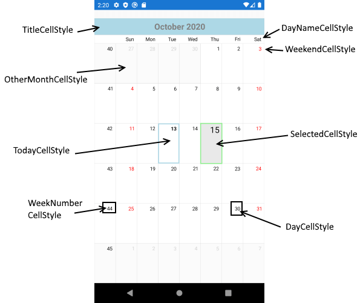

# Cell Styling
 
This article describes the APIs used to customize the look of the calendar cells.

## CalendarCell types

The **CalendarCell** objects are not actual visual elements, but they provide context that the user can use to style different parts of the calendar. [Here]() you can find more information about the calendar visual structure.

All cells share a common base class - the **CalendarCell**. Here are its properties:

- **Text** (string): Gets the text displayed in the cell.
- **Type** (CalendarCellType): Gets the type of the cell. The possible values are:
- **Date**: all cells that correspond to actual dates has this type
- **WeekNumber**: cells that hold week numbers
- **DayName**: cells that hold the days of the week

Below are described the specific calendar cells and their properties.

### CalendarDateCell

These cells hold date values (days, months, years). The Type of CalendarDateCell is `Date`.

- **IsEnabled** (bool): Gets a value that specifies whether the cell is enabled (inside the calendar MinDate and MaxDate range).
- **IsSelected** (bool): Gets a value that specifies whether the cell is currently selected.
- **Date** (DateTime): Gets the date that corresponds to the cell.

### CalendarDayCell

These cells hold dates in Month and Week view. The CalendarDayCell inherits from CalendarDateCell and its Type is also `Date`. 

- **IsFromCurrentMonth** (bool): Gets a value that specifies whether the cell is from the current month in month view.
- **IsToday** (bool): Gets a value that specifies whether the cell date is today.

### CalendarTextCell

These cells hold elements different from dates: week numbers and week day names and correspondingly have Type `WeekNumber` or `DayName`.

## CalendarCellStyle

The **CalendarCellStyle** class provides the following properties:

 - **BackgroundColor** (Color)
 - **BorderColor** (Color)
 - **BorderThickness** (Thickness)
 - **FontSize** (double)
 - **FontWeight** (FontWeight): Bold or Normal.
 - **ForegroundColor** (Color)
 
The RadCalendar component exposes the following properties which enable you to style the calendar cells:

- **TitleCellStyle**(*Telerik.XamarinForms.Input.CalendarCellStyle*): Defines the style for the title cell.
- **DayCellStyle**(*Telerik.XamarinForms.Input.CalendarCellStyle*): Defines the style for the day cell.
- **DayNameCellStyle**(*Telerik.XamarinForms.Input.CalendarCellStyle*): Defines the style for the cells where the day names are.
- **TodayCellStyle**(*Telerik.XamarinForms.Input.CalendarCellStyle*): Defines the style for today cell.
- **WeekNumberCellStyle**(*Telerik.XamarinForms.Input.CalendarCellStyle*): Defines the style for the week number cell.
- **DisabledCellStyle**(*Telerik.XamarinForms.Input.CalendarCellStyle*): Defines the style for the disabled cells.
- **SelectedCellStyle**(*Telerik.XamarinForms.Input.CalendarCellStyle*): Defines the style for the selected cell.
- **WeekendCellStyle**(*Telerik.XamarinForms.Input.CalendarCellStyle*): Defines the style for the weekend cell.
- **OtherMonthCellStyle**(*Telerik.XamarinForms.Input.CalendarCellStyle*): Defines the style for other month cell.


- **SetStyleForCell** (Func&lt;CalendarCell, CalendarCellStyle&gt;): method which can be used for styling the different calendar cells. We do not recommend using this method when applying a Theming mechanisum the styling values set using the SetStyleForCell method are overriden. So we can suggest using the separate properties for cell styling.

## Example with Calendar Cell Styles properties

Here is the RadCalendar definition with the above properties set:

```XAML
<input:RadCalendar WeekNumbersDisplayMode="Show">
    <input:RadCalendar.TitleCellStyle>
        <input:CalendarCellStyle BackgroundColor="LightBlue" 
                                 TextColor="Gray" 
                                 FontSize="20"/>
    </input:RadCalendar.TitleCellStyle>
        
    <input:RadCalendar.DayCellStyle>
        <input:CalendarCellStyle TextColor="Black"/>
    </input:RadCalendar.DayCellStyle>
        
    <input:RadCalendar.DayNameCellStyle>
        <input:CalendarCellStyle TextColor="Black"/>
    </input:RadCalendar.DayNameCellStyle>
        
    <input:RadCalendar.TodayCellStyle>
        <input:CalendarCellStyle BorderColor="LightBlue" 
                                 TextColor="Black" 
                                 BorderThickness="2" />
    </input:RadCalendar.TodayCellStyle>

    <input:RadCalendar.WeekNumberCellStyle>
        <input:CalendarCellStyle TextColor="Black"/>
    </input:RadCalendar.WeekNumberCellStyle>

    <input:RadCalendar.DisabledCellStyle>
        <input:CalendarCellStyle TextColor="LightGray"/>
    </input:RadCalendar.DisabledCellStyle>

    <input:RadCalendar.SelectedCellStyle>
        <input:CalendarCellStyle BorderColor="LightGreen" 
                                 BorderThickness="2" 
                                 TextColor="Black" 
                                 FontSize="20"/>
    </input:RadCalendar.SelectedCellStyle>

    <input:RadCalendar.WeekendCellStyle>
        <input:CalendarCellStyle TextColor="Red"/>
    </input:RadCalendar.WeekendCellStyle>

    <input:RadCalendar.OtherMonthCellStyle>
        <input:CalendarCellStyle TextColor="LightGray" />
    </input:RadCalendar.OtherMonthCellStyle>
</input:RadCalendar>
```

and the final result:



## Example with SetStyleForCell method

>note We do not recommend using this method when applying a Theming mechanisum the styling values set using the SetStyleForCell method are overriden. So we can suggest using the separate properties for cell styling.

This example demonstrates how you can apply styles to different calendar cell types.

<snippet id='calendar-features-cellstyling-setstyleforcell'/>

And this is the method:

<snippet id='calendar-features-cellstyling-evaluatecellstyle'/>

Here is the result:

