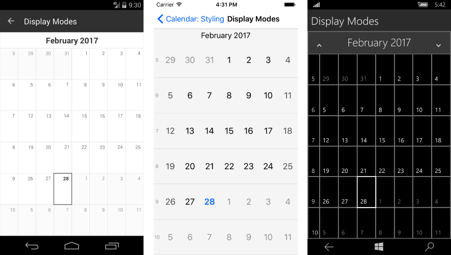

# Elements Display Mode

Sometimes you would like to change the appearance of the calendar by hiding the day names or week numbers. This article will explain how you can acheive this.

The calendar provides properties that control the visibility of its elements each of them gets or returns value of type DisplayMode.

- **DayNamesDisplayMode** (DisplayMode): Gets or sets a value that specifies whether the day names will be visible.
- **WeekNumbersDisplayMode** (DisplayMode): Gets or sets a value that specifies whether the day names will be visible.

The **DisplayMode** enumeration has the following values:

- **Show**: The element will be visible.
- **Hide**: The element will not be visible.
- **Automatic**: The visibility of the element will be determined by the value defined in the platform specific resources.

#### Example

This example demonstrates how you can display the week numbers and hide the day names of the calendar:

<snippet id='calendar-styling-display-mode'/>

Here are the results from the code above:

