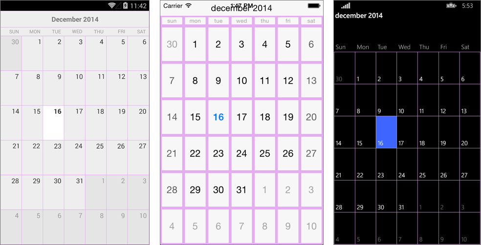

# Grid Lines Style

- **GridLinesDisplayMode** (DisplayMode): Gets or sets a value that specifies whether the grid lines will be visible.
- **GridLinesColor** (Color): Gets or sets the color of the grid lines.
- **GridLinesWidth** (double): Gets or sets the width of the grid lines.

#### Example

This example demonstrates how you can customize the calendar grid lines.

    var calendar = new RadCalendar();
    calendar.GridLinesDisplayMode = DisplayMode.Show;
    calendar.GridLinesColor = Color.FromRgb(229, 173, 241);
    calendar.GridLinesWidth = 3;

This is the result:

