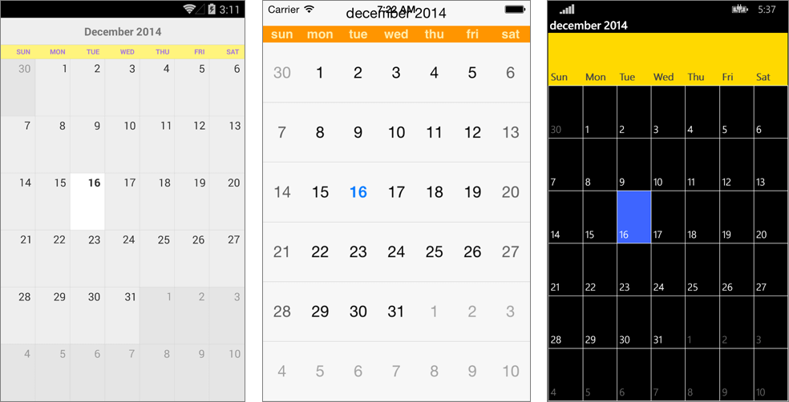

## Resources ##

Sometimes you will need to set different values of the properties for each platform. This could be achieved with the **CalendarResources** class. 

#### CalendarResources ####

This is a special class that uses the singleton pattern. It has a single instance, that is created depending on the platform that the application runs on, and its members are overridden with platform specific values.

It exposes the following members:

- static **Instance** (CalendarResources):   Gets or sets the instance of the CalendarResources class. See the example below to see how you can create your own instance.
- **DisplayWeekNumbers** (bool): Gets the week numbers visibility.
- **DisplayDayNames** (bool): Gets the day names visibility.
- **DisplayGridLines** (bool): Gets the grid lines visibility.
- **GridLinesColor** (Color): Gets the  grid lines color.
- **GridLinesWidth** (double): Gets the grid lines width.
- void **Load**(): You should override this method in the classes that inherit from the CalendarResources class and  call it in order to initialize your own instance.

The CalendarResources class is inherited in each platform by the following classes:

- **Android**: AndroidCalendarResources
- **iOS**: IOSCalendarResources
- **Windows Phone**: WinPhoneCalendarResources

If you wish to change the default values defined by these classes, you can create your own class that inherits from them and and override the members that you wish to change.

#### Example ####

 This example demonstrates how you can change the default visibility of the day names only in Android. You have to create the following class in the Android project:

    public class CustomAndroidCalendarResources : AndroidCalendarResources
    {
        private static CustomAndroidCalendarResources instance = new CustomAndroidCalendarResources();

        private const bool displayDayNames = false;

        static CustomAndroidCalendarResources()
        {
            CalendarResources.Instance = instance;
        }

        private CustomAndroidCalendarResources()
        {
        }

        public static new CustomAndroidCalendarResources Instance
        {
            get
            {
                return instance;
            }
        }

        public override bool DisplayDayNames
        {
            get
            {
                return displayDayNames;
            }
        }

        public override void Load()
        {
        }
    }

After that you have to load the custom resources in the MainActivity.cs class before the Forms.Init(this, bundle) call:

    protected override void OnCreate(Bundle bundle)
    {
        base.OnCreate(bundle);
        CustomAndroidCalendarResources.Instance.Load();
        Forms.Init(this, bundle);
    
        this.SetPage(App.GetMainPage());
    }

Now the calendar will use your instance of CalendarResources class. 

#### User resources ####

Similarly to the CalendarResources class, you can create your own custom resources that will define platform specific properties.

    public abstract class UserResources
    {
        public static UserResources Instance;
    
        public abstract Color Background { get; }

        public abstract double FontSize { get; }

        public abstract Color Foreground { get; }

        public abstract void Load();
    }

In each platform project you have to create a class that inherits from the **UserResources** class:

    public class PlatformUserResources : UserResources
    {
        private static PlatformUserResources instance = new PlatformUserResources();

        static PlatformUserResources()
        {
            UserResources.Instance = instance;
        }

        private PlatformUserResources()
        {
        }

        public static new PlatformUserResources Instance
        {
            get
            {
                return instance;
            }
        }

        public override Xamarin.Forms.Color Background
        {
            get
            {
                return Color.FromRgb(255, 243, 125);
            }
        }

        public override double FontSize
        {
            get
            {
                return 30;
            }
        }
        public override Color Foreground
        {
            get
            {
                return Color.FromRgb(163, 118, 222);
            }
        }

        public override void Load()
        { }
    }

We will return different values in the property getters in each platform.

- **Android**:
 - Background: Color.FromRgb(255, 243, 125)
 - Foreground: Color.FromRgb(163, 118, 222)
 - FontSize: 30

- **iOS**:
 - Background: Color.FromRgb(255, 149, 0)
 - Foreground: Color.FromRgb(255, 235, 171)
 - FontSize: 15
- **Windows Phone**:
 - Background: Color.FromRgb(255, 217, 0)
 - Foreground: Color.FromRgb(70, 70, 70)
 - FontSize: 20

Then you have to initialize the instance of the **UserResources** class by calling the **PlatformUserResources.Instance.Load()** method. This should happen in the platform projects before the Forms.Init(...) call.

- **Android**: in the MainActivity.OnCreate(...) method
- **iOS**: in the AppDelegate.FinishedLaunching(...) method
- **Windows Phone**: in the MainPage class constructor

We will follow the example for the cell styling (above), but we will use a different method to style the cells:

    private CalendarCellStyle EvaluateCellStyle(CalendarCell cell)
    {
        if (cell.Type == CalendarCellType.DayName)
        {
            return new CalendarCellStyle
            {
                BackgroundColor = UserResources.Instance.Background,
                ForegroundColor = UserResources.Instance.Foreground,
                FontSize = UserResources.Instance.FontSize,
                FontWeight = FontWeight.Bold
            };
        }
       
        return null;
    }

Here is the result:

