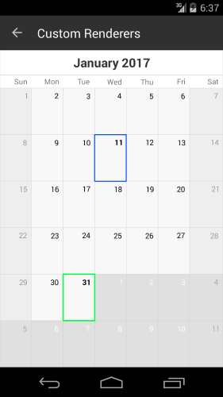

# Custom Calendar Renderer

Sometimes, you might find that certain feature is available in the native control on a given platform, but is not exposed in Xamarin Forms or you might want to customize the calendar look for each platform. This is when you would need to create a custom renderer. This will allow you to access the native control and configure it as per your needs.

>The native **Calendar** control documentation can be found [here](http://docs.telerik.com/devtools/xamarin/nativecontrols/android/calendar/calendar-overview).

## Example

Let us consider the following example: we need to customize how the calendar looks on Android. Create a class which inherits from Telerik.XamarinForms.InputRenderer.Android.CalendarRenderer and override the OnElementChanged method:

<snippet id='calendar-styling-custom-renderers-android-renderer'/>

The CellDecorationsLayer.Color property changes the border color of the currently selected cell. The CustomizationRule property takes an object which implements the Com.Telerik.Android.Common.IProcedure interface:

<snippet id='calendar-styling-custom-renderers-customization-rule'/>

Here is the result:

