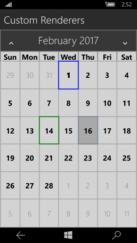

# Custom Calendar Renderer

Sometimes, you might find that certain feature is available in the native control on a given platform, but is not exposed in Xamarin Forms or you might want to customize the calendar look and feel for each platform. This is when you would need to create a custom renderer. This will allow you to access the native control and configure it as per your needs.

>The native **Calendar** control documentation can be found [here](http://docs.telerik.com/devtools/universal-windows-platform/controls/radcalendar/overview).

## Example

Let us consider the following example: we need to customize how the calendar looks like on UWP. Create a class which inherits from Telerik.XamarinForms.InputRenderer.UWP.CalendarRenderer and override the OnElementChanged method:

<snippet id='calendar-styling-custom-renderers-uwp-renderer'/>

The styles used in the code snippet above are defined in a XAML resource dictionary merged with the main page resources of the application:

<snippet id='calendar-styling-custom-renderers-styles'/>

Here is the result:

