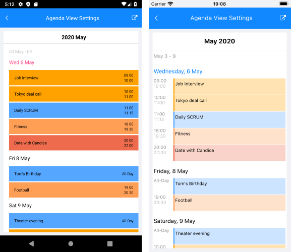
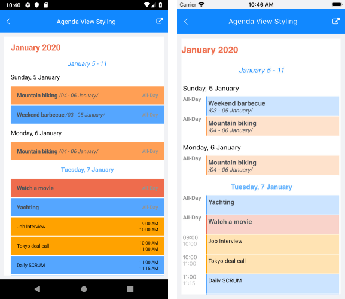

# Agenda View #

With R1 2020 RadCalendar comes with new Agenda view mode which shows a list of the scheduled appointments grouped by date. With AgendaView you can enable the app users to quickly check on everything coming up in their calendars. 

In addition, you have full control over the way the Agenda view is visualized - you can set custom date and time formats as well as modify the style (text color, font, alignment) of each text label shown across the view separately.

>tip AgendaView provides convenient way to display appointments chronologically. For more details on the Appointments feature of RadCalendar refer to [Appointments]() topic. 

In order to enable AgendaView, just set **ViewMode** property of RadCalendar to "Agenda". The image below shows Calendar AgendaView with its default look:


>important AgendaView is available only on Android and iOS.

## Date and Time Format Settings

You can find below a full list of the available date and time format settings for Agenda View:

* **MonthItemFormat**: Defines the format of the label shown at the beginning of each month. 
* **WeekItemStartDateFormat**: Sets the format of the start date of each week;
* **WeekItemEndDateFormat**: Sets the format of the end date of each week;
* **DayItemFormat**: Specifies the format of the label shown at the beginning of each day;
* **AppointmentItemTimeFormat**: Defines the time format shown for the appointments;
* **AppointmentItemStartDateFormat**: Sets the format of the start date of the multi-day appointments;
* **AppointmentItemEndDateFormat**: Specifies the format of the end date of the multi-day appointments;
* **StickyHeaderFormat** : Specifies the format of the label shown in the "frozen" header at the top of the view. For more details on this go to [Sticky Headers]() section.

The next image shows more clearly which format property to which agenda item corresponds:


All of the above are applied using the **AgendaViewSettings** property of RadCalendar. Here is a quick example on how they could be set:

<snippet id='calendar-agendaview-settings'/>

The next image shows Agenda view with the AgendaViewSettings applied:



## Sticky Headers

Starting with R2 2020 AgendaView provides the option to set its month headers as sticky. This means the current month header will "freeze" while scrolling through the items until the whole month is scrolled away. As you scroll through the next month, the currently sticked month header will be pushed by the next month header.

To enable the sticky headers behavior, just set **IsHeaderSticky** property of the AgendaViewSettings to True. 

```XAML
<telerikInput:RadCalendar x:Name="calendar"
						  ViewMode="Agenda">
	<telerikInput:RadCalendar.AgendaViewSettings>
		<telerikInput:AgendaViewSettings IsHeaderSticky="True"
										 StickyHeaderFormat="MMMM, YYYY" />
	</telerikInput:RadCalendar.AgendaViewSettings>
</telerikInput:RadCalendar>
```

In addition, AgendaView provides means for customizing the look &amp; feel of the sticky header through the **StickyHeaderStyle** property of the AgendaViewSettings. 

StickyHeaderStyle is of type *AgendaStickyHeaderStyle* and exposes the following properties: 

* DecorationColor, DecorationHeight - related to the decoration line which separates the sticky header from the rest of the view;
* TextColor, Padding, FontSize, FontFamily, FontAttributes and HorizontalTextAlignment - standard styling settings related to the header label.

Check below a quick example on how **StickyHeaderStyle** can be applied:

Add a sample Calendar definition:

<snippet id='calendar-agendaview-setstickyheader-xaml' />

Add the referenced Style in the Resources section of the page:

<snippet id='calendar-agendaview-stickyheader-style' />

## Agenda Items Styling

RadCalendar provides means for customizing the look &amp; feel of each element of the AgendaView, such as text labels for months, weeks and days as well as the appointments. This is implemented through the **AgendaItemStyleSelector** property of the **AgendaViewSettings** class.

In order to modify the default styles, you would need to create a custom selector class based on the AgendaItemStyleSelector and override the following methods that handle the styling of different agenda view items:

* **SelectMonthItemStyle**: Sets the style of the labels shown at the beginning of each month; Through the parameter of type *AgendaMonthItem* you can receive the exact month the style refers to. 
* **SelectWeekItemStyle**: Specifies the style of the labels shown for each week; Through the parameter of type *AgendaWeekItem* you can get the start and end dates of the week the style refers to.
* **SelectDayItemStyle**: Sets the style of the labels displayed for the days inside the agenda view; Through the parameter of type *AgendaDayItem* you can receive the date the style refers to.

	All of the above methods return an object of type **AgendaTextItemStyle** which provides standard styling settings such as TextColor, Padding, FontSize, FontFamily, FontAttributes and HorizontalTextAlignment.

* **SelectAppointmentItemStyle**: Specifies the style of the appointment agenda items; Through the parameter of type *AgendaAppointmentItem* you can receive the date the appointment is shown for (in case of multi-day appointments) as well as the Appointment instance;

	SelectAppointmentItemStyle returns an object of type **AgendaAppointmentItemStyle**, which in turn, provides the listed below settings:

	* TitleTextColor, TitleFontSize, TitleFontFamily, TitleFontAttributes: Refer to the appointment title label;
	* DaysDurationTextColor, DaysDurationFontSize, DaysDurationFontFamily, DaysDurationFontAttributes: Refer to the start and end dates of the multi-day appointments;
	* TimeDurationTextColor, TimeDurationFontSize, TimeDurationFontFamily, TimeDurationFontAttributes: Refer to the start and end times of the appointments.

Below you can find a sample implementation of a custom class that derives from AgendaItemStyleSelector and overrides its methods for selecting styles for various agenda items: 

<snippet id='calendar-agendaview-styleselector' />

Next, you'd need to add the CustomAgendaViewItemStyleSelector as a resource to your page and define the previously created AgendaTextItemStyle and AgendaAppointmentItemStyle properties:

<snippet id='calendar-agendaview-styleselector-xaml' />

Lastly, add RadCalendar with ViewMode set to "Agenda" and apply the CustomAgendaViewItemStyleSelector through the **AgendaViewSettings** property:

<snippet id='calendar-agendaview-setstyle-xaml' />

Here is the result after running the example:



## See Also

* [View Modes]()
* [Day View]()
* [MultiDay View]()
* [Appointments]()
