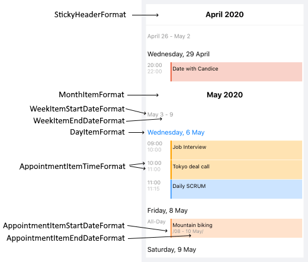

# Agenda View #

With R1 2020 RadCalendar comes with new Agenda view mode which shows a list of the scheduled appointments grouped by date. In addition, you will have full control over the way the Agenda view is visualized through various configuration options such as different date and time formats and 

## Date and Time Format Settings

You can find below a full list of the available date and time format settings for Agenda View:

* **MonthItemFormat**: Defines the format of the label shown at the beginning of each month. 
* **WeekItemStartDateFormat**: Sets the format of the start date of each week;
* **WeekItemEndDateFormat**: Sets the format of the end date of each week;
* **DayItemFormat**: Specifies the format of the label shown at the beginning of each day;
* **AppointmentItemTimeFormat**: Defines the time format shown for the appointments;
* **AppointmentItemStartDateFormat**: Sets the format of the start date of the multi-day appointments;
* **AppointmentItemEndDateFormat**: Specifies the format of the end date of the multi-day appointments;

The next image shows more clearly which format property to which agenda item corresponds:

All of the above are applied using the **AgendaViewSettings** property of RadCalendar. Here is a quick example on how they could be set:

<snippet id='calendar-agendaview-settings'/>

The next image shows Agenda view with the AgendaViewSettings applied:

## Styling

## See Also

* [View Modes]()
* [Appointments]()
* [Special and restricted slots]()
* [Non-working hours]()
