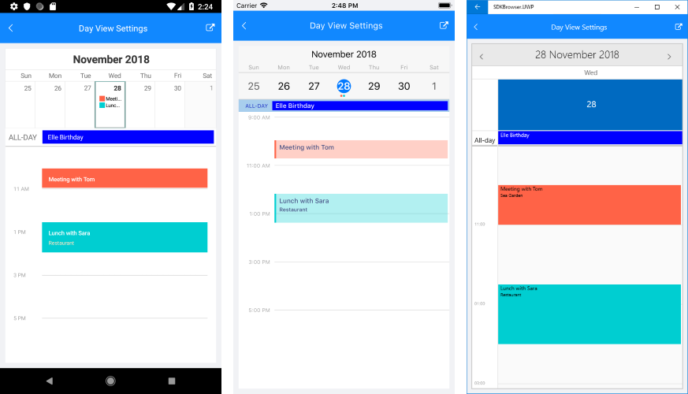

# Day View #

Day ViewMode allows you to display the schedule for a specific day in RadCalendar. You could also take advantage of a few useful configuration and styling options, such as day start and end times, timeline settings, appointments text color and font size, and more.

Day ViewMode provides a convenient way to display appointments for a certain day. For more details on the Appointments feature of RadCalendar refer to [Appointments]() topic.

>note You can also consider [MultiDay ViewMode]() as it gives the option to select how many days to display and provides work week support.

## Timeline Settings

You can specify the initial and end hours displayed in the DayView through the **DayViewSettings** property of RadCalendar. DayViewSettings provides the following configuration options:

* **DayStartTime**: Defines the time used to indicate the start of the Calendar timeline. The default value of the DayStartTime is 00:00:00 or 12:00 AM. 
* **DayEndTime**: Sets the time used to indicate the end of the timeline.
* **TimelineInterval**: This property is of type *TimeSpan* and defines the time intervals inside the timeline.
* **IsCurrentTimeIndicatorVisible**: Boolean property that enables the option to visually mark the current time. In addition, you could customize the way the current time indicator looks through a few styling properties, for more details go to [Styling](#styling) section.

> CurrentTimeIndicator for DayView is available only for Android and iOS. For UWP you can use [MultiDay ViewMode]() with its **VisibleDays** property set to "1".

>tip Through the DayViewSettings you can also configure [Special and restricted slots]() and [Non-working hours]() features of RadCalendar.

## Styling

This section presents the various properties you can use for customizing the visual appearance of different parts of the Day view. All of them are applied through **DayViewStyle** property of RadCalendar. 

#### CurrentTimeIndicator

You can customize the way the current time indicator looks through the styling properties listed below:

* **CurrentTimeIndicatorColor**
* **CurrentTimeIndicatorWidth**
* **CurrentTimeIndicatorRadius**: Specifies the radius of the round marker at the beginning of the indicator on Android and iOS.
 
#### AllDayArea

DayView provides all-day area at the top of the timeline to display appointments that continue a whole day(s). Following are the styling properties related to AllDay area:

* **AllDayAreaBackgroundColor**: Specifies the background color of the AllDay area;
* **AllDayAppointmentBackgroundColor**: Specifies the background of the all-day appointments shown inside AllDay area;
* **AllDayLabelTextColor and AllDayLabelFontSize**: Refer to the Text shown inside time ruler next to the AllDay area;
* **AllDayAppointmentTextColor and AllDayAppointmentFontSize**: Refer to the all-day appointments displayed inside AllDay area;

>tip In order to create all-day appointments you just need to set **IsAllDay** bool property of the Appointment class. For more details on the Appointments feature of RadCalendar refer to [Appointments]() topic.

#### Timeline 

Through **DayViewStyle** you could define the background of the timeline as well as different background to the current day, also the background and font-size of appointments inside timeline.  

* **TimelineBackgroundColor**: Refers to the whole timeline area, except the current day;
* **TimelineLabelsTextColor and TimelineLabelsFontSize**: Refers to the text marking the time intervals;
* **AppointmentTextColor and AppointmentFontSize**: Refer to the Titles of the appointments inside the timeline area;
* **AppointmentDetailsTextColor and AppointmentDetailsFontSize**: Refer to the Detail properties of the appointments inside the timeline area;

## Example

Check the example below demonstrating how DayViewSettings and DaysViewStyle properties are applied:

<snippet id='calendar-dayview-settings' />

And here is the result:

>important **DayView Settings** example can be found in the Calendar &amp; Scheduling/Features folder of the [SDK Samples Browser application](#sdk-browser-application).
>
>You can also explore the example code directly in the [SDKBrowser Examples repository on GitHub](https://github.com/telerik/xamarin-forms-sdk/tree/master/XamarinSDK/SDKBrowser/SDKBrowser/Examples/CalendarControl/FeaturesCategory/DayViewSettingsExample).

## See Also

* [View Modes]()
* [MultiDay ViewMode]()
* [Agenda View]()
* [Appointments]()
* [Special and restricted slots]()
* [Non-working hours]()