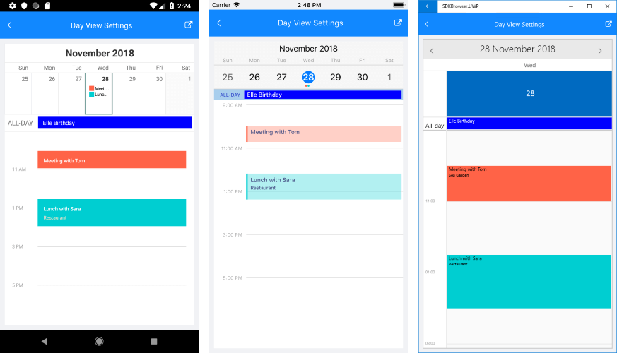

# Day View #

Day ViewMode allows you to display the schedule for a specific day in RadCalendar. You could also take advantage of a few useful configuration and styling options, such as day start and end times, timeline settings, appointments text color and font size, and more.

Day ViewMode provides a convenient way to display appointments for a certain day. For more details on the Appointments feature of RadCalendar refer to [Appointments]() topic.

>note You could also consider [MultiDay ViewMode]() as it gives the option to select how many days to display, provides current time indicator as well as a few other configuration settings.

## Key Features

This section lists the key properties of the Day ViewMode, so you could configure it to best suit your needs.

* **DayStartTime**: Defines the time used to indicate the start of the timeline. The default value of the DayStartTime is 00:00:00 or 12:00 AM. 
* **DayEndTime**: Sets the time used to indicate the end of the timeline.
* **TimelineInterval**: This property is of type *TimeSpan* and defines the time intervals inside the timeline.

All of the above are applied using the **DayViewSettings** property of RadCalendar. 

## Styling

This section presents the various properties you can use for customizing the visual appearance of different parts of the Day view. All of them are applied through **DayViewStyle** property of RadCalendar. 
 
#### AllDayArea

DayView provides AllDay area used to display appointments for the whole day. Following are the properties related to AllDay area:

* **AllDayAreaBackgroundColor**: Specifies the background of AllDay area;
* **AllDayAppointmentBackgroundColor**: Specifies the background of the all-day appointments shown inside AllDay area;
* **AllDayLabelTextColor and AllDayLabelFontSize**: Refer to the Text shown inside time ruler next to the AllDay area;
* **AllDayAppointmentTextColor and AllDayAppointmentFontSize**: Refer to the all-day appointments displayed inside AllDay area;

#### Timeline Styling 

Through DayViewStyle you could define the background of the timeline as well as different background to the current day, also the background and font-size of appointments inside timeline.  

* **TimelineBackgroundColor**: Refers to the whole timeline area, except the current day;
* **TimelineLabelsTextColor and TimelineLabelsFontSize**: Refers to the text marking the time intervals;
* **AppointmentTextColor and AppointmentFontSize**: Refer to the Titles of the appointments inside the timeline area;
* **AppointmentDetailsTextColor and AppointmentDetailsFontSize**: Refer to the Detail properties of the appointments inside the timeline area;

## Example

Check the example below demonstrating how DayViewSettings and DaysViewStyle properties are applied:

<snippet id='calendar-dayview-settings' />

And here is the result:

## See Also

* [View Modes]()
* [Appointments]()
