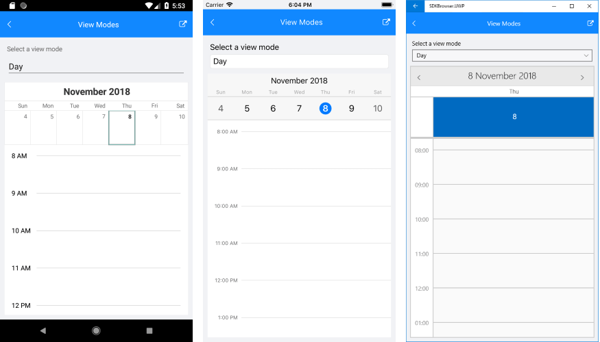
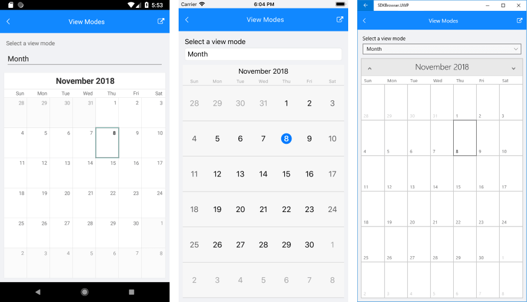
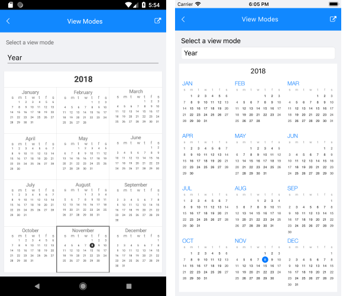

# View Modes

**RadCalendar** is a control that displays a calendar representation from which the user can select a date. There are various View modes that specify what is visible in the Calendar views: **a day**, **few days**, **a month**, **a year**. 

The table below lists the supported view modes for each platform:

| View Mode 		| iOS		| Android 	| UWP		|
| ----------------- | ---------	| ---------	| --------- |
| Month 			| &#x2714;	| &#x2714;	| &#x2714;	|
| Day 				| &#x2714;	| &#x2714;	| &#x2714;	|
| MultiDay 			| &#x2714;	| &#x2714;	| &#x2714;	|
| Agenda			| &#x2714;	| &#x2714;	| - 		|
| Year				| &#x2714;	| &#x2714;	| - 		|
| Week				| &#x2714;	| &#x2714;	| -			|
| MonthNames		| &#x2714;	| -			| -			|
| YearNumbers		| &#x2714;	| -			| -			|
| Flow				| &#x2714;	| -			| - 		|

You could check how the most used view modes look on different platforms below:

#### Day ViewMode



#### Month ViewMode



#### Year ViewMode (available on Android and iOS only)



>tip You can refer to the [MultiDay View]() topic for detailed information on the recently added MultiDay view mode of RadCalendar.

## Setting the ViewMode

**ViewMode** property is of type *CalendarViewMode* and is used to define the current view of RadCalendar control. Starting with R1 2019 release of Telerik UI for Xamarin, you could directly set/bind **ViewMode** property in order to apply a different View:

```XAML
<telerikInput:RadCalendar x:Name="calendar" ViewMode="Month" />
```

>important Keep in mind that setting **ViewMode** property to a value that is not supported on the current platform would throw a NotSupportedException.

You can also use any of the methods listed below for switching the Calendar ViewMode:

 - bool **TrySetViewMode**(CalendarViewMode *view*, bool *isAnimated* = true): Tries to set the view mode of the calendar to the specified value. If the view mode is supported, the method returns `true`, otherwise returns `false`.
 - bool **TryNavigateToUpperView** (bool *isAnimated* = true): Navigates to upper view if possible. Returns `true` if navigation has been successful, `false` otherwise. 
	- **iOS**: `Month` > `MonthNames` > `YearNumbers`
	- **Android**: `Month` > `Year`
	- **UWP**: `Month` > `MonthNames` > `YearNumbers`
 - bool **TryNavigateToLowerView** (bool isAnimated = true): Navigates to lower view if possible. Returns `true` if navigation has been successful, `false` otherwise. 
	- **iOS**: `YearNumbers` > `MonthNames` > `Month`
	- **Android**: `Year` > `Month`
	- **UWP**: `YearNumbers` > `MonthNames` > `Month`
  
>All calendar navigation methods should be called after the native Calendar element has been loaded. Here are the events that you can use:
> 
> - **NativeControlLoaded** (EventArgs): Occurs when the renderer has finished preparing the native control.
> - **NativeControlUnloaded** (EventArgs): Occurs when the native control is in invalid state.

Following is a quick example on how these could be used.

First, you need to attach to the **NativeControlLoaded** event:

```XAML
<telerikInput:RadCalendar x:Name="calendar" NativeControlLoaded="CalendarLoaded" />
```
When the control is loaded, you can change the view mode. 

```C#	
private void CalendarLoaded(object sender, EventArgs args)
{
	(sender as RadCalendar).TrySetViewMode(CalendarViewMode.Day);
}
```
	
## See Also

* [Date Properties]()
* [Day View]()
* [MultiDay View]()
* [Agenda View]()
* [Events]()
