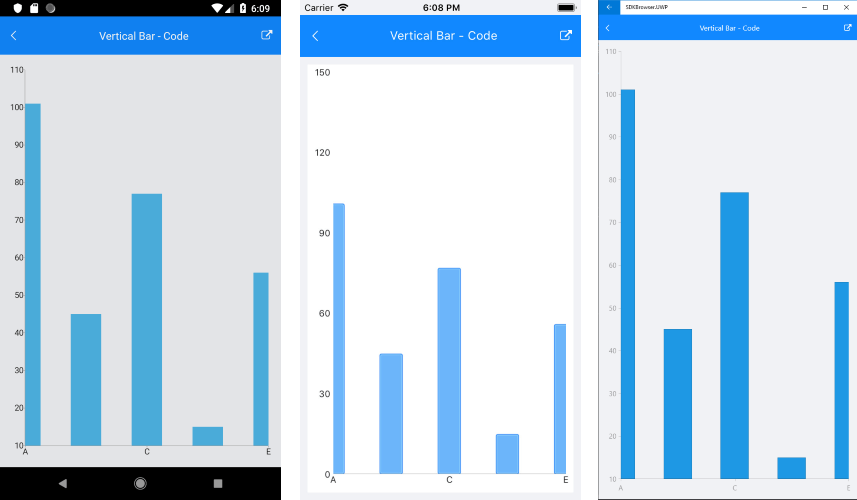

# CategoricalAxis

## Overview

When **RadCartesianChart** visualizes **CategoricalSeries**, it needs an axis that can represent the different categories. Categories are built depending on the **CategoryBinding** value of each categorical data point in the owning CategoricalSeries. The axis is divided into discrete slots and each data point is visualized in the slot corresponding to its categorical value.

The **CategoricalAxis** inherits from the base **Axis** class. You can see the inherited properties [here]().

## Features

- **GapLength**: Defines the distance (in logical units [0,1]) between two adjacent categories. Default value is 0.3. For example if you have BarSeries, you can decrease the space between the bars from the different categories by setting the GapLength to a value lower than 0.3.
- **MajorTickInterval**: Defines the step at which major ticks are generated. The default value is 1. This property will also affect axis labels as they are generated on a per major tick basis.
- **PlotMode**: Defines the strategy used to position data points along the axis category slots. The possible values are:
	- BetweenTicks
	- OnTicks
- **MajorTickBackgroundColor**: Specifies the major ticks color.
- **MajorTickThickness**: Specifies the thickness of the major ticks

## Example

Here is an example how to format axis labes on Categorical Axis:

First, create the needed business objects:

<snippet id='categorical-data-model'/>

Then create a ViewModel:

<snippet id='chart-series-categorical-data-view-model'/>

Finally, use the following snippet to declare the RadChart in XAML or in C#:

```XAML
    <telerikChart:RadCartesianChart>
	  <telerikChart:RadCartesianChart.BindingContext>
	    <local:CategoricalDataViewModel/>
	  </telerikChart:RadCartesianChart.BindingContext>
	  <telerikChart:RadCartesianChart.HorizontalAxis>
	    <telerikChart:CategoricalAxis PlotMode="OnTicks" 
								      MajorTickInterval="2" 
									  GapLength="0.5"/>
	  </telerikChart:RadCartesianChart.HorizontalAxis>
	  <telerikChart:RadCartesianChart.VerticalAxis>
	    <telerikChart:NumericalAxis LabelFitMode="MultiLine"/>
	  </telerikChart:RadCartesianChart.VerticalAxis>
	  <telerikChart:RadCartesianChart.Series>
	    <telerikChart:BarSeries ItemsSource="{Binding Data}" 
		                        ValueBinding="Value"
                                CategoryBinding="Category"/>
	  </telerikChart:RadCartesianChart.Series>
    </telerikChart:RadCartesianChart>
```
```C#
var chart = new RadCartesianChart
{
	BindingContext = new ViewModel2(),
	HorizontalAxis = new CategoricalAxis()
	{
		PlotMode = AxisPlotMode.OnTicks,
        MajorTickInterval = 2,
        GapLength = 0.5
	},
    VerticalAxis = new NumericalAxis()
    {
		LabelFitMode = AxisLabelFitMode.MultiLine,
	},
	Series =
	{
		new BarSeries
       	{
        	ValueBinding = new PropertyNameDataPointBinding("Value"),
        	CategoryBinding = new PropertyNameDataPointBinding("Category")
        }
 	}
};

chart.Series[0].SetBinding(ChartSeries.ItemsSourceProperty, "Data");
```

Here is how the Categorical Axis Format looks:



## See Also

- [Axis Overview]()
- [Numerical Axis]()
- [DateTimeContinuous Axis]()