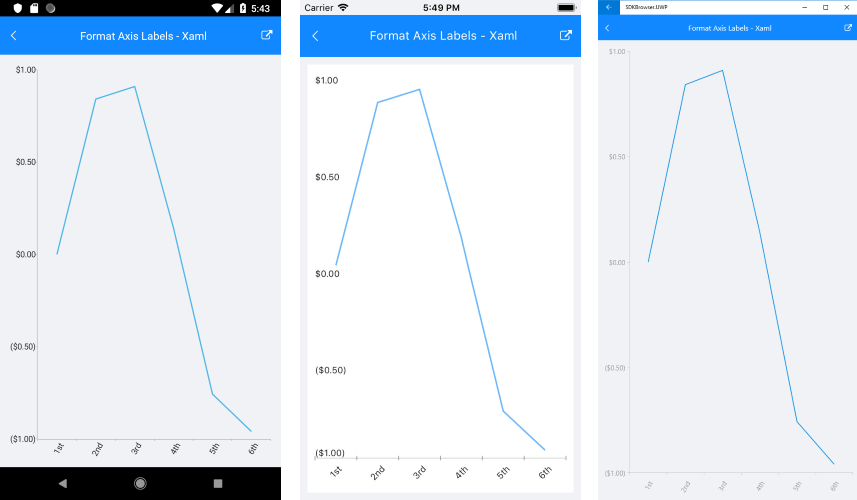

# DateTimeContinuousAxis

## Overview

The **DateTimeContinuousAxis** is a special axis that extends the base CartesianAxis class and may be considered as a hybrid between a categorical and a numerical axis. DateTimeContinuousAxis works with categorical data but instead of categories, the axis builds time slots depending on its Minimum, Maximum and MajorStep values.
DateTimeContinuousAxis also expects valid DateTime values so that the data could be plotted correctly. Think of DateTimeContinuousAxis as a timeline where each data point has a certain position, depending on its DateTime value. The timeline range properties are automatically calculated if not set explicitly by the user: the default value of the major step is the smallest difference between any two DateTime values. There might be empty time slots if no data falling into them is found, because the axis behaves like a numerical one.

The **CategoricalAxis** inherits from the base **Axis** class. You can see the inherited properties [here]().

## Features

- **Minimum**: Defines the start value of the timeline. Specify DateTime.Minimum to clear the value and force the axis to determine it automatically, depending on the smallest DateTime value present.
- **Maximum**: Defines the end value of the timeline. Specify DateTime.Maximum to clear the value and force the axis to determine it automatically, depending on the biggest DateTime value present.
- **PlotMode**: Defines the strategy used to position data points along the axis time slots. Two different options are available: { BetweenTicks, OnTicks }.
- **MajorStep**: Defines the user-defined step between two adjacent time slots. Specify double.PositiveInfinity to clear the value and make the axis calculate an automatic step, depending on the smallest difference between any two dates.
- **MajorStepUnit**: Defines what DateTime component the MajorStep property refers to { Year, Quarter, Month, Week, Day, Hour, Minute, Second, Millisecond }.
- **GapLength**: Defines the distance (in logical units [0,1]) between two adjacent time slots. The default value is 0.3. As an example, if you have two BarSeries combined in Cluster mode, you can remove the space between the bars by setting the GapLength property to 0.

## Example

Here is an example how to format axis labes on DateTimeContinuous Axis:

First, create the needed business objects:

<snippet id='temporal-data-model'/>

Then create a ViewModel:

<snippet id='chart-customization-formataxislabels-view-model'/>

Create a class, for example DateLabelFormatter that inherits from **LabelFormatterBase<DateTime>** for DateTimeContinuous Axis

<snippet id='chart-customization-format-axis-labels-label-formatter'/>

Finally, use the following snippet to declare the RadChart in XAML or in C#:

<snippet id='chart-chart-customization-formataxislabels-xaml'/>
<snippet id='chart-customization-formataxislabels-csharp'/>

Here is how the DateTimeContinuous Axis Formatter looks:

>important A sample Format Axis Label example can be found in the Chart/Customization folder of the [SDK Samples Browser application]().

## See Also

- [Categorical Axis]()
- [Numerical Axis]()
- [Axis Overview]()
