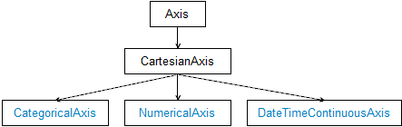

# Overview

**RadCartesianChart** plots data points in a coordinate system defined by its two axes. Instead of having one axis type that does hundreds of things, we have a hierarchy of axes where each concrete axis type expose particular functionality.



The predefined axis types are:

- [**NumericalAxis**]()
- [**CategoricalAxis**]()
- [**DateTimeAxisContinuous**]()

## Common Axis Features

The common axis functionality is encapsulated by the abstract Axis class and is responsible for displaying ticks that simply mark values on the axis at fixed positions. The axis also displays labels that are used to provide a visualization of the values at some or all of the ticks. The default visualization of the labels is text and the default visuals created internally are text blocks. Here is a list with all the properties exposed by the base axis type.

### Label Style and Position

You can customize the labels orientation and style with the following properties:

- **LabelFitMode**: Specifies how labels that exceed axis bounding rectangle should be positioned. These are the available fit options:
 - **MultiLine**: Arranges axis labels on multiple lines with each label on a different line than its neighbor labels.
 - **Rotate**: Arranges the axis labels so that they are rotated some degrees around their top left corner.
- **LabelFontSize**: Specifies the font size of the labels.
- **LabelTextColor**: Specifies the color of the labels.

#### Example

```XAML 
<telerikChart:CategoricalAxis LabelFitMode="Rotate" 
							  LabelFontSize="25" 
							  LabelTextColor="#FFCC88CC"/>
```
	
### Label Format

You can customize the labels text with the following properties:

- **LabelFormat**: Provides a format string that will be used when converting the label value to string. Each axis type requires different format:
  - **NumericalAxis**: any numeric format like `"N"`, `"P2"`
  - **DateTimeContinuousAxis**: any date format like `"dd-MM-yy"`, `"HH:mm"`
  - **CategoricalAxis**: `"{0} items"`, `"{0:N}"`
- **LabelFormatter**: Specifies a custom formatter that implements the **ILabelFormatter** interface to apply a custom rule for setting each label text.

#### Example

Here is a quick snippet how you can set **LabelFormat** to a NumericalAxis:

```XAML
<telerikChart:NumericalAxis LabelFormat="C"
							MajorStep="0.5"
							Minimum="-1"
							Maximum="1" />
```

### Label Formatter

The **LabelFormatterBase<T>** class is a base implementation of the **ILabelFormatter** interface that could be used in the most common scenarios. Below is an example of a label formatter for DateTimeContinuousAxis.

#### Example

<snippet id='chart-customization-format-axis-labels-label-formatter'/>

And you could apply it like this:

```XAML
<telerikChart:DateTimeContinuousAxis LabelFitMode="Rotate"
                                     MajorStepUnit="Day">
    <telerikChart:DateTimeContinuousAxis.LabelFormatter>
        <local:DateLabelFormatter />
    </telerikChart:DateTimeContinuousAxis.LabelFormatter>
</telerikChart:DateTimeContinuousAxis>
```

### Styling the Axis Line and Ticks

You can customize the appearance of the axis line and ticks with the following properties:

- **MajorTickBackgroundColor**: Specifies the major ticks color.
- **MajorTickThickness**: Specifies the thickness of the major ticks.
- **LineColor**: Specifies the color of the axis line.
- **LineDashArray**: Specifies the array used to create a dash line that will be applied to the axis line.

#### Example

```XAML
	<telerikChart:NumericalAxis MajorTickBackgroundColor="#FFCC88CC" 
								MajorTickThickness="5" 
								LineColor="#FFCC88CC"/>
```

### Location

You can specify the location of the axis:

- **HorizontalLocation**: Specifies the horizontal location of the axis. Applicable for vertical axes. 
- **VerticalLocation**: Specifies the vertical location of the axis. Applicable for horizontal axes.

#### Example

```XAML
	<telerikChart:CategoricalAxis VerticalLocation="Top"/>
```

## See Also

- [Categorical Axis]()
- [Numerical Axis]()
- [DateTimeContinuous Axis]()
