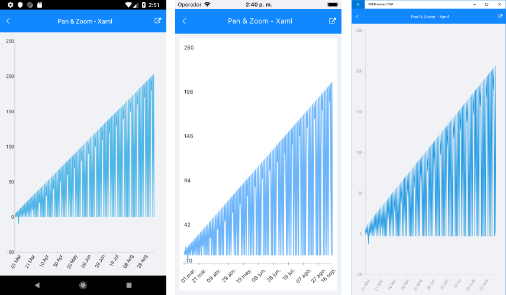

# ChartPanAndZoomBehavior

## Overview

With **ChartPanAndZoomBehavior**, RadChart handles the gestures drag, pinch open and pinch close which respectively cause panning, zooming in and zooming out of the associated chart plot area.

## Features

- **ZoomMode**: Gets or sets value that specifies how the chart will respond to a zoom gesture. The available values are:
	- None
	- Horizontal
	- Vertical
	- Both
- **PanMode**: Gets or sets value that specifies how the chart will respond to a pan gesture. The available values are:
	- None
	- Horizontal
	- Vertical
	- Both
- **HandleDoubleTap**: Determines whether a double-tap gesture will be handled by the behavior to reset the values of the Zoom and ScrollOffset (Pan) properties of the chart.

>important With R2 2018 SP release Behaviors property of RadChart was replaced with **ChartBehaviors**. Behaviors property is marked as obsolete, so please use **ChartBehaviors** instead.

## Example

Here is an example of how the Chart PanAndZoom Behavior works:

First, create the needed business objects, for example:

<snippet id='temporal-data-model'/>

Then create a ViewModel:

<snippet id='chart-pan-and-zoom-behavior-view-model'/>

Finally, use the following snippet to declare a RadCartesianChart in XAML and in C#:

<snippet id='chart-interactivity-panzoom-xaml'/>
<snippet id='chart-interactivity-panzoom-csharp'/>

Where the **telerikChart** namespace is the following:

<snippet id='xmlns-telerikchart'/>
<snippet id='ns-telerikchart'/>

Here is the result:

>important A sample Pan And Zoom example can be found in the Chart/Interactivity folder of the [SDK Samples Browser application]().

# See Also

- [Chart Selection Behavior]()
- [Chart Track Ball Behavior]()
- [Chart Tool Tip Behavior]()

	
