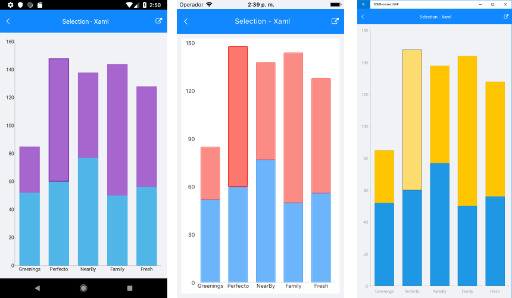

# ChartSelectionBehavior

## Overview

**ChartSelectionBehavior** is responsible for selecting, deselecting and reporting the selection of either data points or series. In other words, the selection behavior can target data points, series or both if required.

>important With R2 2018 SP release Behaviors property of RadChart was replaced with **ChartBehaviors**. Behaviors property is marked as obsolete, so please use **ChartBehaviors** instead.

## Features

### Properties

- **DataPointSelectionMode**: Gets or sets the ChartSelectionMode that controls the selection behavior of the data points within the chart series. The available values are:
	-  None
	-  Single
	-  Multiple
- **SeriesSelectionMode**: Gets or sets the ChartSelectionMode that controls the selection behavior of the series within the plot area. The available values are:
	-  None
	-  Single
	-  Multiple
- **SelectedPoints**: Retrieves all the points from all series within the chart plot area that are currently selected.
- **SelectedSeries**: Retrieves all the series instances within the plot area that are currently selected.

### Methods

- **ClearSelecton()** method : Removes the current selection within the chart.

### Events

- **SelectionChanged** event: Occurs when a selection has been made.

### Commands

ChartSelectionBehavior exposes support for **Commands**. 

## Example

Here is an example of how the Chart Selection Behavior works with Command:

First, create the needed business objects, for example:

<snippet id='categorical-data-model'/>

Then create a ViewModel:

<snippet id='chart-selection-behavior-view-model'/>

Finally, use the following snippet to declare a RadCartesianChart in XAML and in C#:

<snippet id='chart-interactivity-selectionseries-xaml'/>
<snippet id='chart-interactivity-selectionseries-csharp'/>

Where the **telerikChart** namespace is the following:

<snippet id='xmlns-telerikchart'/>
<snippet id='ns-telerikchart'/>

Here is how the selection looks:

>important A sample Selection example can be found in the Chart/Interactivity folder of the [SDK Samples Browser application]().

# See Also

- [Chart Track Ball Behavior]()
- [Chart Tool Tip Behavior]()
- [Chart Pan And Zoom Behavior]()
