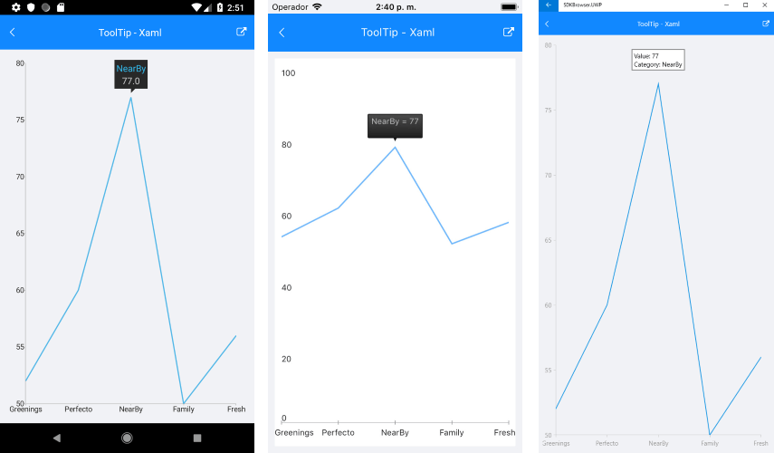

# ChartToolTipBehavior

## Overview

**ChartTooltipBehavior** is responsible for rendering concise information about a data point in a small popup which is displayed close to its relevant data point.

>important With R2 2018 SP release Behaviors property of RadChart was replaced with **ChartBehaviors**. Behaviors property is marked as obsolete, so please use **ChartBehaviors** instead.

## Features

- **TriggerMode**: Determines the gestures on which the ChartToolTipBehavior should show a tool tip. The available values are:
	- Tap
	- Hold

## Example

Here is an example of how the Chart ToolTip Behavior works:

First, create the needed business objects, for example:

<snippet id='categorical-data-model'/>

Then create a ViewModel:

<snippet id='chart-tool-tip-behavior-view-model'/>

Finally, use the following snippet to declare a RadCartesianChart in XAML and in C#:

<snippet id='chart-interactivity-tooltipseries-xaml'/>
<snippet id='chart-interactivity-tooltipseries-csharp'/>

Where the **telerikChart** namespace is the following:

<snippet id='xmlns-telerikchart'/>
<snippet id='ns-telerikchart'/>

Here is how the tool-tip looks:

>important A sample ToolTip example can be found in the Chart/Interactivity folder of the [SDK Samples Browser application]().

# See Also

- [Chart Selection Behavior]()
- [Chart Track Ball Behavior]()
- [Chart Pan And Zoom Behavior]()
