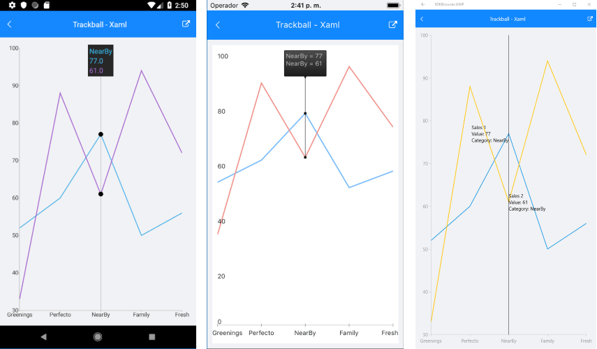

# ChartTrackBallBehavior

## Overview

**ChartTrackBallBehavior** is responsible for rendering concise information about several data points in a small popup which displays over its relevant data points. A vertical line is also drawn through the data points for maximum clarity.

>important With R2 2018 SP release Behaviors property of RadChart was replaced with **ChartBehaviors**. Behaviors property is marked as obsolete, so please use **ChartBehaviors** instead.

## Features 

- **ShowTrackInfo**(bool):  Determines whether the visual information for all the closest data points will be displayed.
- **ShowIntersectionPoints**(bool): Defines a value indicating whether a visual information for all the closest data points will be displayed.

## Example

Here is an example of how the Chart TrackBall Behavior works:

First, create the needed business objects, for example:

<snippet id='categorical-data-model'/>

Then create a ViewModel:

<snippet id='chart-track-ball-behavior-view-model'/>

Finally, use the following snippet to declare a RadCartesianChart in XAML and in C#:

<snippet id='chart-interactivity-trackballseries-xaml'/>
<snippet id='chart-interactivity-trackballseries-csharp'/>

Where the **telerikChart** namespace is the following:

<snippet id='xmlns-telerikchart'/>
<snippet id='ns-telerikchart'/>

Here is how the trackball looks:

>important A sample TrackBall example can be found in the Chart/Interactivity folder of the [SDK Samples Browser application]().

# See Also

- [Chart Selection Behavior]()
- [Chart Tool Tip Behavior]()
- [Chart Pan And Zoom Behavior]()

