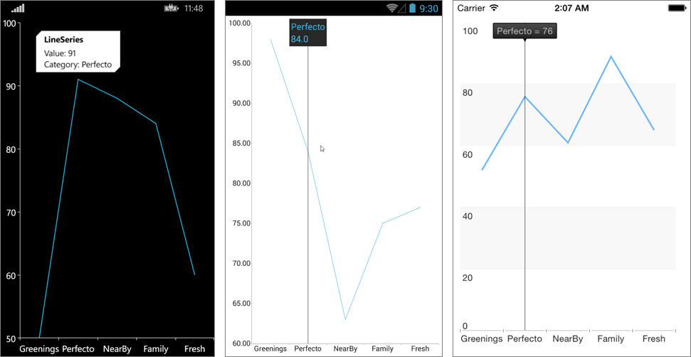

# ChartTrackBallBehavior #

## Overview ##
**ChartTrackBallBehavior** is responsible for rendering concise information about several data points in a small popup which displays over its relevant data points. A horizontal or vertical line is also drawn through the data points for maximum clarity.

>important With R2 2018 SP release Behaviors property of RadChart was replaced with **ChartBehaviors**. Behaviors property is marked as obsolete, so please use **ChartBehaviors** instead.

## Features ##

- **ShowTrackInfo**:  Determines whether the visual information for all the closest data points will be displayed.

## Example ##

    <telerikChart:RadCartesianChart>
	  <telerikChart:RadCartesianChart.BindingContext>
	    <viewMoedls:CategoricalViewModel/>
	  </telerikChart:RadCartesianChart.BindingContext>
	
	  <telerikChart:RadCartesianChart.ChartBehaviors>
	    <telerikChart:ChartTrackBallBehavior ShowTrackInfo="True"  />
	  </telerikChart:RadCartesianChart.ChartBehaviors>
	  <telerikChart:RadCartesianChart.HorizontalAxis>
	    <telerikChart:CategoricalAxis/>
	  </telerikChart:RadCartesianChart.HorizontalAxis>
	  <telerikChart:RadCartesianChart.VerticalAxis>
	    <telerikChart:NumericalAxis/>
	  </telerikChart:RadCartesianChart.VerticalAxis>
	  <telerikChart:RadCartesianChart.Series>
	    <telerikChart:LineSeries ItemsSource="{Binding CategoricalData}">
	      <telerikChart:LineSeries.ValueBinding>
	        <telerikChart:PropertyNameDataPointBinding PropertyName="Value"/>
	      </telerikChart:LineSeries.ValueBinding>
	      <telerikChart:LineSeries.CategoryBinding>
	        <telerikChart:PropertyNameDataPointBinding PropertyName="Category"/>
	      </telerikChart:LineSeries.CategoryBinding>
	    </telerikChart:LineSeries>
	  </telerikChart:RadCartesianChart.Series>
    </telerikChart:RadCartesianChart>

Here is how the trackball looks:

