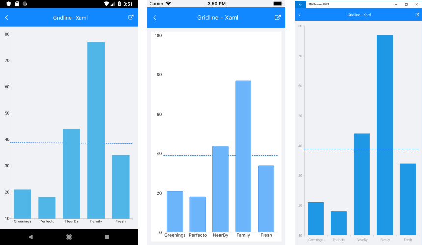
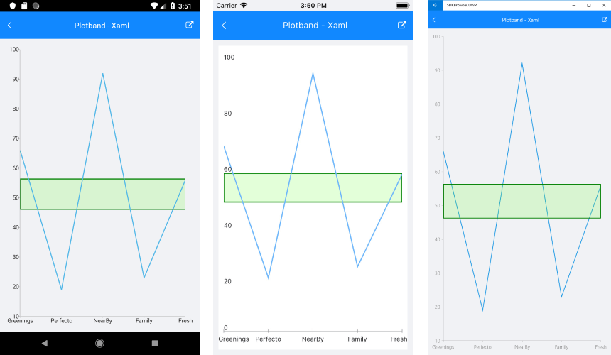

# Annotations 

## Overview

**Annotations** are visual elements used to highlight certain areas on the plot. They can be used as comments or as markers for specific values on the plot. You can practically use any visual element as a template for the annotation.

RadChart provides support for the following types of annotations:

- **Cartesian GridLineAnnotations**: this annotation is visually represented by straight lines across the chart that marks a specific value on the associated Cartesian axis.
- **Cartesian PlotBandAnnotations**: this annotation is visually represented by a band across the chart that marks a specific range on the associated Cartesian axis.

## CartesianGridLineAnnotation

The **CartesianGridLineAnnotation** represents a vertical or horizontal line that crosses the entire plot area.

### Features

- **Axis** : the CartesianGridLineAnnotation should be associated with horizontal or vertical cartesian axis explicitly.
- **Value** : the place on the associated axis where a line crosses it.

> Note: When the associated axis is numerical - a numeric value is expected, and when it is a CategoricalAxis - a category is expected. 

### Example

Here is an example of how the CartesianGridLineAnnotation works:

First, create the needed business objects:

<snippet id='categorical-data-model'/>

Then create a ViewModel:

<snippet id='chart-annotations-grid-line-view-model'/>

Finally, use the following snippet to declare the RadChart in XAML or in C#:

<snippet id='chart-annotations-gridline-xaml'/>
<snippet id='chart-annotations-gridline-csharp'/>

Here is how the CartesianGridLineAnnotation looks:

>important A sample CartesianGridLineAnnotation example can be found in the Chart/Annotations folder of the [SDK Samples Browser application]().

## CartesianPlotBandAnnotation

The **CartesianPlotBandAnnotation** represents a vertical or horizontal area that crosses the entire plot area.  

### Features

- **Axis** : the cartesian plotband annotation needs to be associated with horizontal or vertical axis explicitly.
- **From** : the starting value for the plotband.
- **To** : the ending value for the plotband.
- **Fill** :  Gets or sets the Fill. 

### Example

Here is an example of how the CartesianPlotBandAnnotation works:

First, create the needed business objects:

<snippet id='categorical-data-model'/>

Then create a ViewModel:

<snippet id='chart-annotations-plot-band-view-model'/>

Finally, use the following snippet to declare the RadChart control in XAML or in C#:

<snippet id='chart-annotations-plotband-xaml'/>
<snippet id='chart-annotations-plotband-csharp'/>

Here is how the CartesianPlotBandAnnotation looks:

>important A sample CartesianPlotBandAnnotation example can be found in the Chart/Annotations folder of the [SDK Samples Browser application]().

## See Also

- [CartesianChart Grid]()
- [Chart Legend]()
- [Chart Null Values]()
