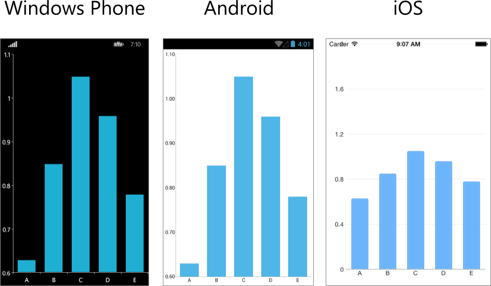

# Getting Started #
This example will guide you through the steps needed to add a basic RadCartesianChart control in your application.

## Add References to Telerik UI for Xamarin.Forms ##
First you have to create a new Xamarin.Forms project. You can see how in the [Getting Started Example]( "Getting Started with Telerik UI foe Xamarin.Forms"). Then you have to add reference to the following assemblies:

* **Portable** (if you have created Xamarin.Forms Portable App)
	* Telerik.XamarinForms.Chart.dll
	* Telerik.XamarinForms.Common.dll
* **Android**
	* ChartBindings.dll
	* CommonBindings.dll
	* PrimitivesBindings.dll
	* Telerik.XamarinForms.Chart.dll
	* Telerik.XamarinForms.ChartRenderer.Android.dll
	* Telerik.XamarinForms.Common.dll
* **iOS**
	* ChartBindings.dll
	* CommonBindings.dll
	* PrimitivesBindings.dll
	* Telerik.XamarinForms.Chart.dll
	* Telerik.XamarinForms.ChartRenderer.Android.dll
	* Telerik.XamarinForms.Common.dll
* **WinPhone**
	* ChartBindings.dll
	* CommonBindings.dll
	* PrimitivesBindings.dll
	* Telerik.XamarinForms.Chart.dll
	* Telerik.XamarinForms.ChartRenderer.Android.dll
	* Telerik.XamarinForms.Common.dll
		
 		

You will also have to add the following code to these project files:

* **Android**: MainActivity.cs
  
		[assembly: Xamarin.Forms.ExportRenderer(typeof(Telerik.XamarinForms.Chart.RadCartesianChart), typeof(Telerik.XamarinForms.AndroidChartRenderer.CartesianChartRenderer))]
		[assembly: Xamarin.Forms.ExportRenderer(typeof(Telerik.XamarinForms.Chart.RadPieChart), typeof(Telerik.XamarinForms.AndroidChartRenderer.PieChartRenderer))]

* **iOS**: AppDelegate.cs

		[assembly: Xamarin.Forms.ExportRenderer(typeof(Telerik.XamarinForms.Chart.RadCartesianChart), typeof(Telerik.XamarinForms.ChartRenderer.iOS.CartesianChartRenderer))]
		[assembly: Xamarin.Forms.ExportRenderer(typeof(Telerik.XamarinForms.Chart.RadPieChart), typeof(Telerik.XamarinForms.ChartRenderer.iOS.PieChartRenderer))]
	You also have to create the following instances in the FinishedLaunching() method:

		new Telerik.XamarinForms.ChartRenderer.iOS.PieChartRenderer();
		new Telerik.XamarinForms.ChartRenderer.iOS.CartesianChartRenderer();

* **WinPhone**: MainPage.xaml.cs
    
		[assembly: Xamarin.Forms.ExportRenderer(typeof(Telerik.XamarinForms.Chart.RadCartesianChart), typeof(Telerik.XamarinForms.ChartRenderer.WinPhone.CartesianChartRenderer))]
		[assembly: Xamarin.Forms.ExportRenderer(typeof(Telerik.XamarinForms.Chart.RadPieChart), typeof(Telerik.XamarinForms.ChartRenderer.WinPhone.PieChartRenderer))]

##Add Chart Control to Your Project##
1. Add new Xamarin.Forms page to your Portable/Shared project:
	* **Visual Studio**: right click on the project > `Add` > `New Item...` > choose `Forms Xaml Page`
	* **Xamarin Studio**: right click on the project > `Add` > `New File` > choose `Forms ContentPage Xaml`
1. Modify the GetMainPage() method in the App.xaml.cs file to set the newly created page as a front page of the application:

		public class App
		{
			public static Page GetMainPage()
			{
				return new MainPage();
			}
		}
1. Edit the MainPage.xaml file to add a RadChart control:

		<StackLayout VerticalOptions="FillAndExpand" HorizontalOptions="FillAndExpand">
		  <telerikChart:RadCartesianChart x:Name="barChart" HeightRequest="600">
		    <telerikChart:RadCartesianChart.BindingContext>
		      <local:MainViewModel/>
		    </telerikChart:RadCartesianChart.BindingContext>
		    <telerikChart:RadCartesianChart.HorizontalAxis>
		      <telerikChart:CategoricalAxis/>
		    </telerikChart:RadCartesianChart.HorizontalAxis>
		    <telerikChart:RadCartesianChart.VerticalAxis>
		      <telerikChart:NumericalAxis/>
		    </telerikChart:RadCartesianChart.VerticalAxis>
		    <telerikChart:RadCartesianChart.Series>
		      <telerikChart:BarSeries ItemsSource="{Binding Data}">
		        <telerikChart:BarSeries.ValueBinding>
		          <telerikChart:PropertyNameDataPointBinding PropertyName="Value"/>
		        </telerikChart:BarSeries.ValueBinding>
		        <telerikChart:BarSeries.CategoryBinding>
		          <telerikChart:PropertyNameDataPointBinding PropertyName="Category"/>
		        </telerikChart:BarSeries.CategoryBinding>
		      </telerikChart:BarSeries>
		    </telerikChart:RadCartesianChart.Series>
		  </telerikChart:RadCartesianChart>
		</StackLayout>
where:  

		xmlns:telerikChart="clr-namespace:Telerik.XamarinForms.Chart;assembly=Telerik.XamarinForms.Chart"
Alternatively, you can add the chart in code behind:

	    public partial class MainPage
	    {
	        public MainPage()
	        {
	            InitializeComponent();
				this.BindingContext = new MainViewModel();

	            BackgroundColor = Color.FromRgb(240, 240, 240);
	            var layout = new StackLayout { HorizontalOptions = LayoutOptions.FillAndExpand, VerticalOptions = LayoutOptions.FillAndExpand };
	            layout.Children.Add(CreateChart());
	            Content = layout;
	        }
	
	        private static RadCartesianChart CreateChart()
	        {
	            var chart = new RadCartesianChart
	            {
	                HorizontalAxis = new Telerik.XamarinForms.Chart.CategoricalAxis(),
	                VerticalAxis = new Telerik.XamarinForms.Chart.NumericalAxis(),
	                HeightRequest = 600
	            };
	
	            var series = CreateSeries();
	
	            chart.Series.Add(series);
	            return chart;
	        }
	
	        private static BarSeries CreateSeries()
	        {
	            var series = new Telerik.XamarinForms.Chart.BarSeries();
	            series.SetBinding(BarSeries.ItemsSourceProperty, new Binding("Data"));
	
	            series.ValueBinding = new Telerik.XamarinForms.Chart.PropertyNameDataPointBinding
	            {
	                PropertyName = "Value"
	            };
	
	            series.CategoryBinding = new Telerik.XamarinForms.Chart.PropertyNameDataPointBinding
	            {
	                PropertyName = "Category"
	            };
	
	            return series;
	        }
	    }
And here is the sample data used as binding context:  

		public class CategoricalData
		{
		    public object Category { get; set; }
		
		    public double Value { get; set; }
		}

	    public class MainViewModel
	    {
	        public MainViewModel()
	        {
	            this.Data = GetCategoricalData();
	        }
	
	        public List<CategoricalData> Data { get; set; }
	
	        public string Title { get; set; }
	
	        public static List<CategoricalData> GetCategoricalData()
	        {
	            List<CategoricalData> data = new List<CategoricalData>
	            {
	                new CategoricalData { Category = "A", Value = 0.63 },
	                new CategoricalData { Category = "B", Value = 0.85 },
	                new CategoricalData { Category = "C", Value = 1.05 },
	                new CategoricalData { Category = "D", Value = 0.96 },
	                new CategoricalData { Category = "E", Value = 0.78 },
	            };
	
	            return data;
	        }
	    }
Here is the result:  
