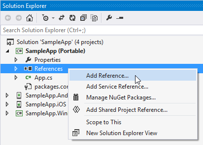

# Getting Started #
This example will guide you through the steps needed to add a basic RadCartesianChart control in your application.

## Add References to Telerik UI for Xamarin.Forms ##
First you have to create a new Xamarin.Forms project. You can see how in the [Getting Started Example]( "Getting Started with Telerik UI for Xamarin.Forms"). Then you have to add reference to the following assemblies:

> The path of the assemblies is relative to the `Binaries` folder that is located in the installation folder of the controls.  
>The default location is `C:\Program Files (x86)\Telerik\UI for Xamarin QX XXX\Binaries`. 

Before adding reference to any Telerik library

>Please make sure the required [Xamarin.Forms and Xamarin.Android.Support]() libraries are installed on your PC.

### Portable Project

#### XamarinForms\\Common\\

- Telerik.XamarinForms.Chart.dll
- Telerik.XamarinForms.Common.dll

### Android Project

#### Android\\

- Telerik.Xamarin.Android.Chart.dll
- Telerik.Xamarin.Android.Common.dll
- Telerik.Xamarin.Android.Primitives.dll

#### XamarinForms\\Common\\

- Telerik.XamarinForms.Chart.dll
- Telerik.XamarinForms.Common.dll

#### XamarinForms\\Android\\

- Telerik.XamarinForms.ChartRenderer.Android.dll
- Telerik.XamarinForms.Common.Android.dll

### iOS Project

#### iOS\\

- Telerik.Xamarin.iOS.dll

#### XamarinForms\\Common\\

- Telerik.XamarinForms.Chart.dll
- Telerik.XamarinForms.Common.dll

#### XamarinForms\\iOS\\

- Telerik.XamarinForms.ChartRenderer.iOS.dll
- Telerik.XamarinForms.Common.iOS.dll

### Windows Phone 8 Poject

#### WindowsPhone\\

- Telerik.Windows.Controls.Chart.dll
- Telerik.Windows.Controls.Primitives.dll
- Telerik.Windows.Core.dll

#### XamarinForms\\Common\\

- Telerik.XamarinForms.Chart.dll
- Telerik.XamarinForms.Common.dll

#### XamarinForms\\WindowsPhone\\

- Telerik.XamarinForms.ChartRenderer.WinPhone.dll
- Telerik.XamarinForms.Common.WinPhone.dll

### Windows 8.1 Project

#### WinRT\\Common\\

- Telerik.Core.dll

#### WinRT\\Windows 8.1\\

- Telerik.UI.Xaml.Chart.dll
- Telerik.UI.Xaml.Primitives.dll

#### XamarinForms\\Common\\

- Telerik.XamarinForms.Chart.dll
- Telerik.XamarinForms.Common.dll

#### XamarinForms\\WinRT\\

- Telerik.XamarinForms.Common.WinRT.dll

#### XamarinForms\\\WinRT\\\Windows\\

- Telerik.XamarinForms.ChartRenderer.WinRT.Windows.dll

### Windows Phone 8.1 Project

#### WinRT\\Common\\

- Telerik.Core.dll

#### WinRT\\Windows Phone 8.1\\

- Telerik.UI.Xaml.Chart.dll
- Telerik.UI.Xaml.Primitives.dll

#### XamarinForms\\Common\\

- Telerik.XamarinForms.Chart.dll
- Telerik.XamarinForms.Common.dll

#### XamarinForms\\WinRT\\

- Telerik.XamarinForms.Common.WinRT.dll

#### XamarinForms\\\WinRT\\\WinPhone\\

- Telerik.XamarinForms.ChartRenderer.WinRT.WindowsPhone.dll

## Edit Project Files

### Android Project

You have add the following lines to the **MainActivity.cs** file:
  
	[assembly: Xamarin.Forms.ExportRenderer(typeof(Telerik.XamarinForms.Chart.RadCartesianChart), typeof(Telerik.XamarinForms.ChartRenderer.Android.CartesianChartRenderer))]
	[assembly: Xamarin.Forms.ExportRenderer(typeof(Telerik.XamarinForms.Chart.RadPieChart), typeof(Telerik.XamarinForms.ChartRenderer.Android.PieChartRenderer))]

### iOS Project

You have add the following lines to the **AppDelegate.cs** file:

	[assembly: Xamarin.Forms.ExportRenderer(typeof(Telerik.XamarinForms.Chart.RadCartesianChart), typeof(Telerik.XamarinForms.ChartRenderer.iOS.CartesianChartRenderer))]
	[assembly: Xamarin.Forms.ExportRenderer(typeof(Telerik.XamarinForms.Chart.RadPieChart), typeof(Telerik.XamarinForms.ChartRenderer.iOS.PieChartRenderer))]

### Windows Phone 8 Project

You have add the following lines to the **MainPage.xaml.cs** file:

	[assembly: Xamarin.Forms.ExportRenderer(typeof(Telerik.XamarinForms.Chart.RadCartesianChart), typeof(Telerik.XamarinForms.ChartRenderer.WinPhone.CartesianChartRenderer))]
	[assembly: Xamarin.Forms.ExportRenderer(typeof(Telerik.XamarinForms.Chart.RadPieChart), typeof(Telerik.XamarinForms.ChartRenderer.WinPhone.PieChartRenderer))]

### Windows 8.1 and Windows Phone 8.1 Projects

You have add the following lines to edit the **MainPage.xaml.cs** file:

	[assembly: Xamarin.Forms.Platform.WinRT.ExportRenderer(typeof(RadCartesianChart), typeof(Telerik.XamarinForms.ChartRenderer.WinRT.CartesianChartRenderer))]
	[assembly: Xamarin.Forms.Platform.WinRT.ExportRenderer(typeof(RadPieChart), typeof(Telerik.XamarinForms.ChartRenderer.WinRT.PieChartRenderer))]

## NuGet Packages
Next step is to add references to the NuGet Packages needed by the chart controls in the Android project. You can find the full list with required packages in the [**Required Android Support Libraries**]() help topic.
	

##Example

1. Add new Xamarin.Forms page to your Portable/Shared project:
	* **Visual Studio**: right click on the project > `Add` > `New Item...` > choose `Forms Xaml Page`
	* **Xamarin Studio**: right click on the project > `Add` > `New File` > choose `Forms ContentPage Xaml`
1. Modify the GetMainPage() method in the App.xaml.cs file to set the newly created page as a front page of the application:

		public class App
		{
			public static Page GetMainPage()
			{
				return new MainPage();
			}
		}

1. Edit the MainPage.xaml file to add a RadChart control:

		<telerikChart:RadCartesianChart x:Name="barChart">
		  <telerikChart:RadCartesianChart.BindingContext>
		    <local:MainViewModel/>
		  </telerikChart:RadCartesianChart.BindingContext>
		  <telerikChart:RadCartesianChart.HorizontalAxis>
		    <telerikChart:CategoricalAxis/>
		  </telerikChart:RadCartesianChart.HorizontalAxis>
		  <telerikChart:RadCartesianChart.VerticalAxis>
		    <telerikChart:NumericalAxis/>
		  </telerikChart:RadCartesianChart.VerticalAxis>
		  <telerikChart:RadCartesianChart.Series>
		    <telerikChart:BarSeries ItemsSource="{Binding Data}">
		      <telerikChart:BarSeries.ValueBinding>
		        <telerikChart:PropertyNameDataPointBinding PropertyName="Value"/>
		      </telerikChart:BarSeries.ValueBinding>
		      <telerikChart:BarSeries.CategoryBinding>
		        <telerikChart:PropertyNameDataPointBinding PropertyName="Category"/>
		      </telerikChart:BarSeries.CategoryBinding>
		    </telerikChart:BarSeries>
		  </telerikChart:RadCartesianChart.Series>
		</telerikChart:RadCartesianChart>

where:  

	xmlns:telerikChart="clr-namespace:Telerik.XamarinForms.Chart;assembly=Telerik.XamarinForms.Chart"

Alternatively, you can add the chart in code behind:

    public partial class MainPage
    {
        public MainPage()
        {
            InitializeComponent();
			this.BindingContext = new MainViewModel();
            BackgroundColor = Xamarin.Forms.Device.OnPlatform(Xamarin.Forms.Color.White, Xamarin.Forms.Color.White, Xamarin.Forms.Color.Transparent);
            
			this.Content = CreateChart();
        }

        private static RadCartesianChart CreateChart()
        {
            var chart = new RadCartesianChart
            {
                HorizontalAxis = new Telerik.XamarinForms.Chart.CategoricalAxis(),
                VerticalAxis = new Telerik.XamarinForms.Chart.NumericalAxis(),
            };

            var series = CreateSeries();

            chart.Series.Add(series);
            return chart;
        }

        private static BarSeries CreateSeries()
        {
            var series = new Telerik.XamarinForms.Chart.BarSeries();
            series.SetBinding(BarSeries.ItemsSourceProperty, new Binding("Data"));

            series.ValueBinding = new Telerik.XamarinForms.Chart.PropertyNameDataPointBinding
            {
                PropertyName = "Value"
            };

            series.CategoryBinding = new Telerik.XamarinForms.Chart.PropertyNameDataPointBinding
            {
                PropertyName = "Category"
            };

            return series;
        }
    }
And here is the sample data used as binding context:  

	public class CategoricalData
	{
	    public object Category { get; set; }
	
	    public double Value { get; set; }
	}

    public class MainViewModel
    {
        public MainViewModel()
        {
            this.Data = GetCategoricalData();
        }

        public List<CategoricalData> Data { get; set; }

        public string Title { get; set; }

        public static List<CategoricalData> GetCategoricalData()
        {
            List<CategoricalData> data = new List<CategoricalData>
            {
                new CategoricalData { Category = "A", Value = 0.63 },
                new CategoricalData { Category = "B", Value = 0.85 },
                new CategoricalData { Category = "C", Value = 1.05 },
                new CategoricalData { Category = "D", Value = 0.96 },
                new CategoricalData { Category = "E", Value = 0.78 },
            };

            return data;
        }
    }
Here is the result:  

## See Also

- [Project Wizard]()
- [Getting Started on Mac]()