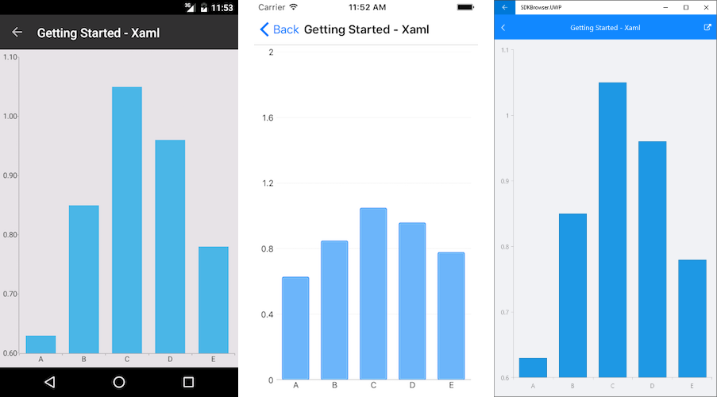

# Getting Started #
   
This article will guide you through the steps needed to add a basic **RadChart** control in your application.

* [Setting up the app](#1-setting-up-the-app)
* [Adding the required Telerik references](#2-adding-the-required-telerik-references)
* [Adding RadChart control](#3-adding-radchart-control)
* [Populating RadChart with data](#4-populating-radchart-with-data)

## 1. Setting up the app ##

Take a look at these articles and follow the instructions to set up your app:

- [Set up app with Telerik UI for Xamarin on Windows]()
- [Set up app with Telerik UI for Xamarin on Mac]()

## 2. Adding the required Telerik references ##

You have two options:

* Add the Telerik UI for Xamarin Nuget package following the instructions in [Telerik NuGet package server]() topic.

If you don't want to add the all Telerik.UI.for.Xamarin nuget package, you have the option to install a separate nuget package. For RadChart control you have to install the **Telerik.UI.for.Xamarin.Chart** nuget package. This nuget will automatically refer the Telerik.UI.for.Xamarin.Common nuget package.

* Add the references to Telerik assemblies manually, check the list below with the required assemblies for **RadChart** component:

| Platform | Assemblies |
| -------- | ---------- |
| Portable | Telerik.XamarinForms.Common.dll Telerik.XamarinForms.Chart.dll |
| Android  | Telerik.Xamarin.Android.Common.dll Telerik.Xamarin.Android.Chart.dll Telerik.Xamarin.Android.Primitives.dll Telerik.XamarinForms.Common.dll Telerik.XamarinForms.Chart.dll |
| iOS      | Telerik.Xamarin.iOS.dll  Telerik.XamarinForms.Common.dll Telerik.XamarinForms.Chart.dll |
| UWP      | Telerik.Core.dll Telerik.UI.Xaml.Chart.UWP.dll Telerik.UI.Xaml.Primitives.UWP.dll Telerik.XamarinForms.Common.dll Telerik.XamarinForms.Chart.dll |

## 3. Adding RadChart control ##

You could use one of the following approaches:

#### Drag the control from the Toolbox. ####

Take a look at the following topics on how to use the toolbox:

* [Telerik UI for Xamarin Toolbox on Windows]()
* [Telerik UI for Xamarin Toolbox on Mac]()
	
#### Create the control definition in XAML or C#. ####

The snippet below shows a simple RadChart definition:

<snippet id='chart-getting-started-xaml-chart'/>
<snippet id='chart-getting-started-csharp-chart'/>

In addition to this, you need to add the following namespace:

<snippet id='xmlns-telerikchart'/>
<snippet id='ns-telerikchart'/>

## 4. Populating RadChart with data ##

Here is how the business model is defined:

<snippet id='categorical-data-model'/>

Here is the sample data used as binding context:

<snippet id='chart-getting-started-viewmodel'/>

Here is the result:

>important **SDK Browser** and **QSF** applications contain different examples that show RadChart's main features. You can find the applications in the **Examples** and **QSF** folders of your local **Telerik UI for Xamarin** installation.

## See Also ##

- [Cartesian Chart]()
- [Pie Chart]()
- [Chart Legend]()