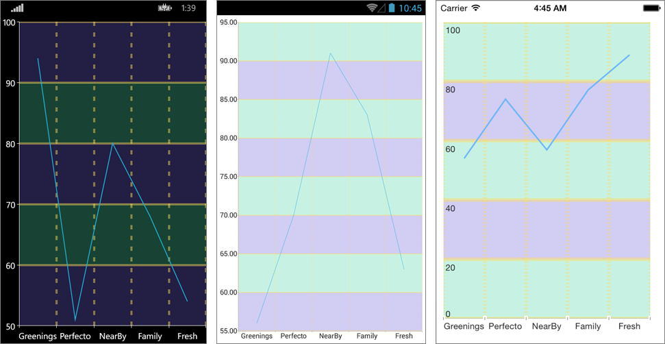

# CartesianChartGrid

## Overview

The CartesianChartGrid represents a decoration over the plot area of RadCartesianChart. It adds major lines connected to each Major tick of each axis. You can set a new grid through the RadCartesianChart.Grid property.

## Features

- **MajorLinesVisibility** : Gets or sets the visibility of major grid lines. In other means : a line that extends the major ticks throughout the plot area.
- **MajorLineThickness**: Gets or sets the thickness of the Major Grid Lines.
- **MajorLineColor**: Gets or sets the color the of Major Grid Lines.
- **MajorXLineDashArray** : Gets or sets a collection of Double values that indicates the pattern of dashes and gaps that is used to outline Major X Grid Line.
- **MajorYLineDashArray**: Gets or sets a collection of Double values that indicates the pattern of dashes and gaps that is used to outline Major Y Grid Line.
- **StripeLinesVisibility**:  Gets or sets the visibility of the grid stripes. In other means : the area between two grid lines.
- **YStripeColor** : Gets or sets the color of the area between two major ticks of the Vertical Axis. This color alternates with the YStripeAlternativeColor starting from the first area.
- **YStripeAlternativeColor** : Gets or sets the color of the area between two major ticks of the Vertical Axis. This color alternates with the YStripeColor starting from the second area.
- **XStripeColor**: Gets or sets the color of the area between two major ticks of the Horizontal Axis. This color alternates with the XStripeAlternativeColor starting from the first area.
- **XStripeAlternativeColor**: Gets or sets the color of the area between two major ticks of the Horizontal Axis. This color alternates with the XStripeAlternativeColor starting from the second area.

## Example

Here is an example how the CartesianChartGrid works:

First, create the needed business objects:

<snippet id='categorical-data-model'/>

Then create a ViewModel:

<snippet id='chart-customization-grid-lines-view-model'/>

Finally, use the following snippet to declare the RadChart in XAML or in C#:

<snippet id='chart-customization-gridlines-xaml'/>
<snippet id='chart-customization-gridlines-csharp'/>

Here is how the CartesianGridLineAnnotation looks:

>important A sample Glid Lines example can be found in the Chart/Customization folder of the [SDK Samples Browser application]().

## See Also

- [Chart Annotations]()
- [Chart Legend]()
- [Chart Null Values]()
