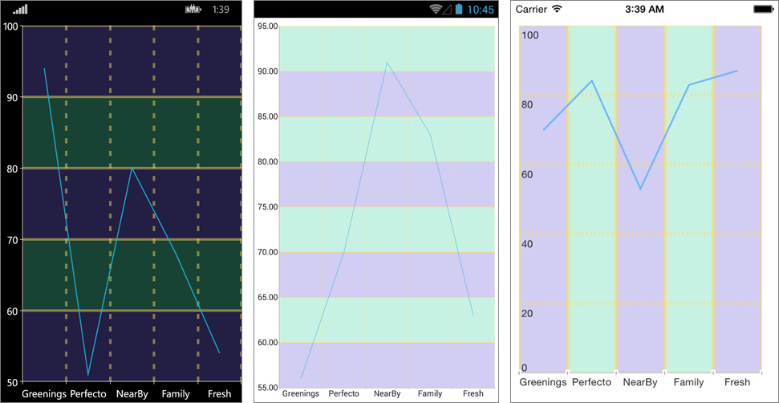

#Overview#

The CartesianChartGrid represents a decoration over the plot area of RadCartesianChart. It adds major lines connected to each Major tick of each axis. You can set a new grid through the RadCartesianChart.Grid property.

#Features#

- **MajorLinesVisibility** : Gets or sets the visibility of major grid lines. In other means : a line that extends the major ticks throughout the plot area.
- **MajorLineThickness**: Gets or sets the thickness of the Major Grid Lines.
- **MajorLineColor**: Gets or sets the color the of Major Grid Lines.
- **MajorXLineDashArray** : Gets or sets a collection of Double values that indicates the pattern of dashes and gaps that is used to outline Major X Grid Line.
- **MajorYLineDashArray**: Gets or sets a collection of Double values that indicates the pattern of dashes and gaps that is used to outline Major Y Grid Line.
- **StripeLinesVisibility**:  Gets or sets the visibility of the grid stripes. In other means : the area between two grid lines.
- **YStripeColor** : Gets or sets the color of the area between two major ticks of the Vertical Axis. This color alternates with the YStripeAlternativeColor starting from the first area.
- **YStripeAlternativeColor** : Gets or sets the color of the area between two major ticks of the Vertical Axis. This color alternates with the YStripeColor starting from the second area.
- **XStripeColor**: Gets or sets the color of the area between two major ticks of the Horizontal Axis. This color alternates with the XStripeAlternativeColor starting from the first area.
- **XStripeAlternativeColor**: Gets or sets the color of the area between two major ticks of the Horizontal Axis. This color alternates with the XStripeAlternativeColor starting from the second area.

#Example#
    <telerikChart:RadCartesianChart>
	    <telerikChart:RadCartesianChart.BindingContext>
	      <viewMoedls:CategoricalViewModel/>
	    </telerikChart:RadCartesianChart.BindingContext>
	
	    <telerikChart:RadCartesianChart.Grid>
	      <telerikChart:CartesianChartGrid x:Name="grid"  MajorLinesVisibility="Y" StripLinesVisibility="Y"  />
	    </telerikChart:RadCartesianChart.Grid>
	    <telerikChart:RadCartesianChart.HorizontalAxis>
	      <telerikChart:CategoricalAxis/>
	    </telerikChart:RadCartesianChart.HorizontalAxis>
	    <telerikChart:RadCartesianChart.VerticalAxis>
	      <telerikChart:NumericalAxis/>
	    </telerikChart:RadCartesianChart.VerticalAxis>
	    <telerikChart:RadCartesianChart.Series>
	      <telerikChart:LineSeries ItemsSource="{Binding CategoricalData}">
	        <telerikChart:LineSeries.ValueBinding>
	          <telerikChart:PropertyNameDataPointBinding PropertyName="Value"/>
	        </telerikChart:LineSeries.ValueBinding>
	        <telerikChart:LineSeries.CategoryBinding>
	          <telerikChart:PropertyNameDataPointBinding PropertyName="Category"/>
	        </telerikChart:LineSeries.CategoryBinding>
	      </telerikChart:LineSeries>
	    </telerikChart:RadCartesianChart.Series>
    </telerikChart:RadCartesianChart>

In the code behind:

	this.grid.YStripeColor = Color.FromRgba(109, 96, 216, 80);
	this.grid.YStripeAlternativeColor = Color.FromRgba(77, 213, 165, 80);
	this.grid.MajorLineThickness = 5;
	this.grid.MajorLineColor = Color.FromRgba(255, 219, 92, 120);
	this.grid.MajorXLineDashArray = new double[] { 2, 3 };

Here is the result:

