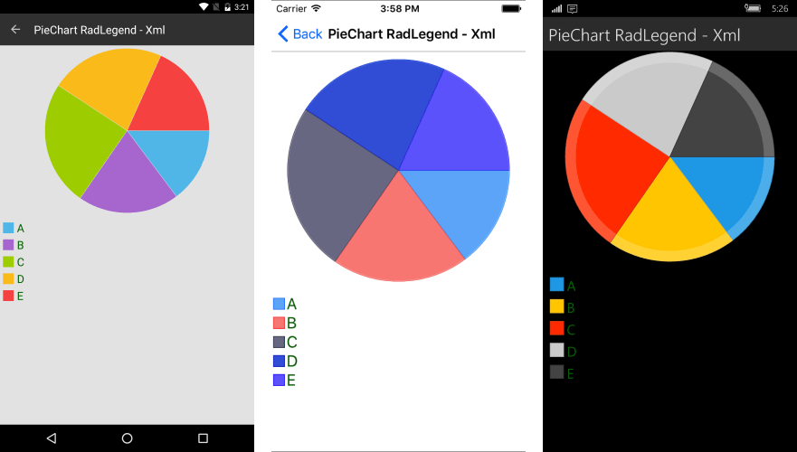
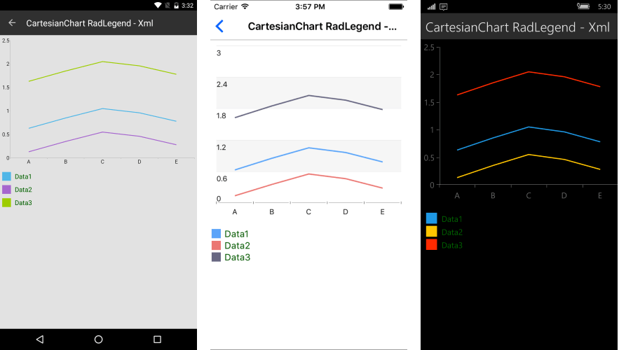

# Chart Legend #

The Legend feature of the **RadChart** makes it easy for you to provide description regarding the series which are visualized within the control. In order to add the legend feature in your application, you need to initialize a new object of type **RadLegend**. 

Chart Legend definition:

<snippet id='chart-features-piechart-legend-definition-xaml'/>
<snippet id='chart-features-piechart-legend-definition-cs'/>

#### **Figure 1: RadLegend in combination with PieChart**

As shown in **Figure 1**, each item within the **RadLegend** represents particular series. The most important property which you need to set is the **LegendProvider**. It should point to the chart object whose series will be included in the legend. 

Here are the most important properties of the **RadLegend** control. In brackets is commented the type of the property:

* **LegendProvider**(RadChartBase): The Chart control whose series will be described in the legend.
* **LegendItemFontSize**(double): The size of the item's title text.
* **LegendItemFontColor**(Color): The color of the item's title text.
* **LegendItemIconSize**(Size): The size of the title icons.
* **Orientation**(LegendOrientation): Sets the orientation of the legend. Can be Horizontal or Vertical.

The control can be used in combination with **RadCartesianChart** as well. 

<snippet id='chart-features-cartesianchart-legend-definition-xaml'/>
<snippet id='chart-features-cartesianchart-legend-definition-cs'/>

#### **Figure 2: RadLegend in combination with CartesianChart**

## LegendTitleBinding

The **LegendTitleBinding** is a property which can be set specifically for the **PieSeries**. It points to the property of the data item which will be used as a title in the legend. For all other series, the **DisplayName** property will be used instead.

<snippet id='chart-features-piechart-legendtitlebinding-xaml'/>
<snippet id='chart-features-piechart-legendtitlebinding-cs'/>

## See Also

- [CartesianChartGrid]()
- [Annotations]()
