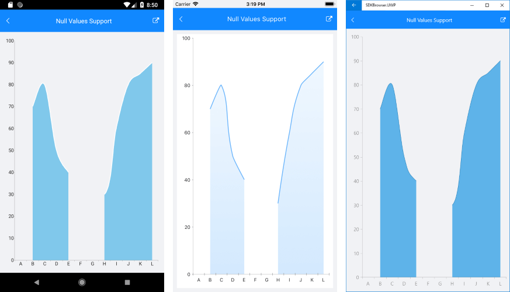

# Null Values #

There are many scenarios, in which some of the data points visualized in RadChart contain empty/null values. These are the cases when data is not available for some records from the used dataset.
In cases of CartesianSeries that require X and Y axes (line, area, bar, etc), RadChart represents null data points with an empty space or gap. In case of other chart types (pie, donut) these data points are not visualized.
 
The following example demonstrates a databound scenario where nullable double type is used.

First, create a ViewModel with a collection of *CategoryItems* objects, where a few of the items have null values:

<snippet id='chart-nullvalues-viewmodel' />

Then, add RadCartesianChart with SplineAreaSeries, for example:

<snippet id='chart-nullvalues-xaml' />

The image below shows how the null data points are visualized as gaps.

## See Also

- [Series Overview]()
