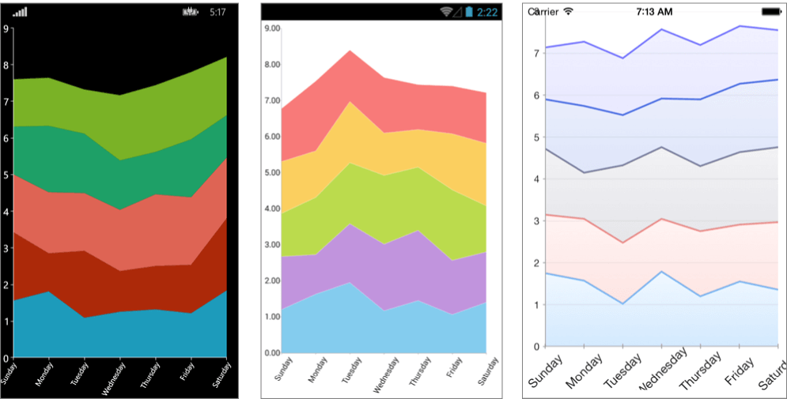

# RadChart Overview #

**Telerik Chart for Xamarin** is a feature-rich, intuitive and easy to use data visualization control which employs the Xamarin.Forms technology and allows you to build native iOS, Android and Windows Phone apps in C#. For the Xamarin wrapper lovers, Telerik Chart comes also in the form of Xamarin.iOS and Xamarin.Android wrappers on top of the native Telerik iOS and Android suites.

While Chart for Xamarin capitalizes all the innate benefits of the native UI, it exposes its objects and properties in C#, allowing for no-compromise customization and flexibility. Using Telerik Chart along with the Xamarin.Forms technology allows developers to easily implement various chart scenarios in their apps from a single shared C# code base.

The intuitive object model and public API allow complex charts to be easily setup either in XAML or in code-behind. RadChart is completely data aware as the binding mechanism of the control is used to create the appropriate data points from the raw data. Chart types and series are organized in hierarchies, depending on the coordinate system, used to plot data points.

## Chart Types ##

### RadCartesianChart ###

As the name hints, the [**RadCartesianChart**]() control uses the Cartesian coordinate system to plot the data points in its chart series. The X and Y axes define how each point's coordinates in the plot area are calculated.

#### Axes ####

The following Cartesian axes are available:

- [**Categorical**](): Arranges the plotted data points in categories where the key of each category is the point’s value (if available) for that axis or its index within the points collection. The point’s coordinate, specified by this axis, is discrete and is calculated depending on the size of the category slot where the point resides.
- [**Numerical**](): Calculates the coordinate of each data point, depending on the actual numerical value this point provides for the axis. Exposes Minimum and Maximum properties to allow explicit definition of the range of values visible on this axis. If these properties are not specified, the axis will automatically calculate the range, depending on the minimum and maximum data point values.
- [**Date-Time Continuous**](): A special axis that expects each data point to provide a System.DateTime structure as its value for this axis. Think of this axis as a time line where the coordinate of each data point is calculated depending on the position of its associated DateTime on the time line. The base unit (or the step) of the axis is calculated depending on the smallest difference between any two dates.

#### Series ####

The following Cartesian series are available:

- **Categorical**: Categorical series need a [**Numerical**]() and a [**Categorical**]()/[**Date-Time Continuous**]() axis in order to get properly plotted.
    - [**Bar**](): Data points are represented by a box where the height (width) of the box is the distance between the point’s numerical value and the categorical axis that plots the point. Bars may be either "horizontal" or "vertical" depending on whether the categorical axis is specified as an "X-axis" or as a "Y-axis".
    - [**Line**](): Data points are connected with straight line segments.
    - [**Spline**](): Data points are connected with smooth line segments.
    - [**Area**](): Data points and the corresponding coordinate axis enclose an area that may be optionally stroked and/or filled.
    - [**SplineArea**](): An area, where points are connected with smooth rather than straight segments.

Each of the above series of the same type may be combined in either [stacks or clusters](). Combinations are formed when more than one data point from different series fall within the same category. The "Cluster" combine mode will position such points next to each other while the "Stack" combine mode will arrange such points in a stack-like structure. When stacks are formed, the numerical axis (if present) will consider each stack as a single entity and its sum will be the actual value used rather than each point’s one.

- **Scatter**: Scatter series need two Numerical axes in order to get properly plotted. Scatted data provides both the X and the Y coordinate.
    - [**ScatterPoint**](): Data points are represented by an arbitrary template.
    - [**ScatterLine**](): Data points are connected with straight line segments.
    - [**ScatterSpline**](): Data points are connected with smooth line segments.
    - [**ScatterArea**](): Data points and the horizontal axis enclose an area that may be optionally stroked and/or filled.
    - [**ScatterSplineArea**](): A ScatterArea, where points are connected with smooth rather than straight segments.
    
#### CartesianChartGrid ####

The Cartesian chart may be optionally decorated with grid-like visuals that support horizontal and vertical lines, associated with axis ticks and horizontal and vertical stripes – the area between two adjacent ticks. For more information you can see the [CartesianChartGrid section]().

### PieChart ###

The [**RadPieChart**]() control visualizes its data points using a discrete polar coordinate system. Each point is represented as an arc segment. The arc’s length represents the point’s value percentage of the total sum.

## Behaviors ##

Optionally, each chart may be enabled with interactivity through its Behaviors property. A behavior is generally an abstraction that handles user input in a RadChart instance and optionally provides visual feedback upon some action. The following behaviors are available:

- [**PanAndZoomBehavior**](): This behavior handles Manipulation events and/or MouseMove/MouseWheel to enable panning and zooming of the associated chart plot area.
- [**TooltipBehavior**](): This behavior handles Hold and/or MouseMove events to enable context-sensitive information about a data point. It differs from the TrackballBehavior in terms of visual information and trigger action.
- [**SelectionBehavior**](): This behavior handles the Tap event to enable selection/deselection of data points and/or chart series. When a data point becomes "Selected", the Chart's SelectionPalette property is used to visualize the selected point.
- [**ChartTrackBallBehavior**](): This behavior handles Hold events to enable context-sensitive information about a data point.

## Annotations ##

Another feature of RadChart is the ability to show [annotations](). They are visual elements that can be used to highlight certain areas on the plot area and denote statistical significance. The provided types of annotations include:

- **CartesianGridLine**: In the case of the Cartesian chart, the grid line represents a vertical or horizontal line which crosses the entire plot area.
- **CartesianPlotBand**: The Cartesian Plot Band annotation is either a horizontal or a vertical stripe that crosses entirely the vertical or horizontal axis, respectively.

## Palettes ##

The [chart palettes]() are a set of predefined values that you can use to set colors of a chart.

## Labels ##

Chart can display different labels for the series and axes that are displayed. The labels can be customized according to your preferences.

## Platform-Specific Features ##

You can [customize the control]() for a specific platform by creating a custom renderer.
