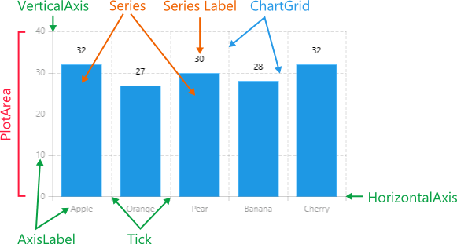

# Visual Structure #

Here are described all visual elements and terms used in a standard RadChart control.

## Legend ##

- **PlotArea**: The area that contains the data series (on the image it is the area inside the rectangle defined by the axes).
- **Series**: The visual representation of the data.
- **SeriesLabels**: Labels that provide specific information about the data points in the series.
- **VerticalAxis/HorizontalAxis**: Axes that define the coordinate system used to plot the data.
- **Tick**: Marks specific values on the axes.
- **AxisLabel**: Labels for specific values on the axes.
- **ChartGrid**: Grid lines that mark specific values on the chart area.