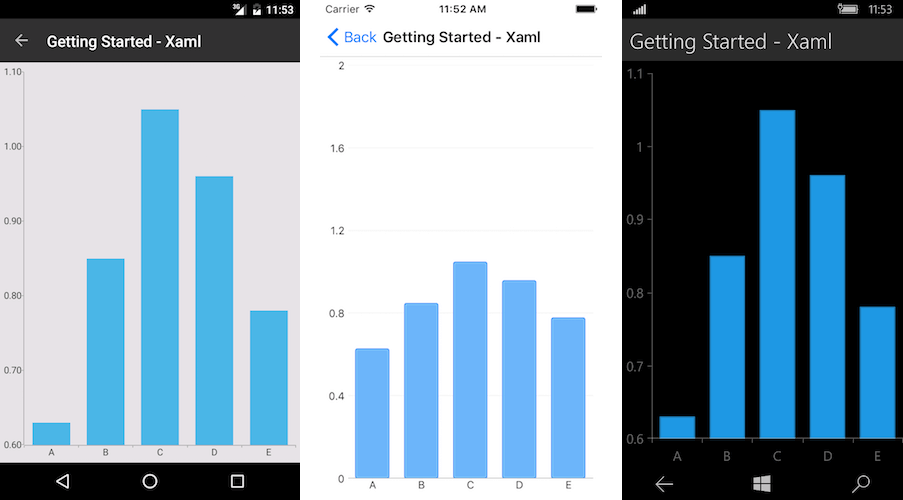

# Getting Started
   
This example will guide you through the steps needed to add a basic **RadChart** control in your application.

>Before you proceed, please, take a look at these articles and follow the instructions to setup your app:

>- [Setup on Windows]()
>- [Setup on Mac]()

## Example

If your app is setup, you are ready to add a **RadChart** control.

This example demonstrates how to create a basic cartesian chart with bar series like this one.

Here is the chart setup:

<snippet id='chart-getting-started-xaml-chart'/>
<snippet id='chart-getting-started-csharp-chart'/> 

You also need to add the following namespace:

<snippet id='xmlns-telerikchart'/>
<snippet id='ns-telerikchart'/>

And here is the sample data used as binding context:

<snippet id='chart-getting-started-viewmodel'/>

Here is how the business model is defined:

<snippet id='categorical-data-model'/>

>important The **SDK Browser** and the **QSF** applications contain different examples that show RadChart's main features. You can find the applications in the **Examples** and **QSF** folders of your local **Telerik UI for Xamarin** installation.

## See Also

- [Project Wizard]()
- [Getting Started on Windows]()
- [Getting Started on Mac]()