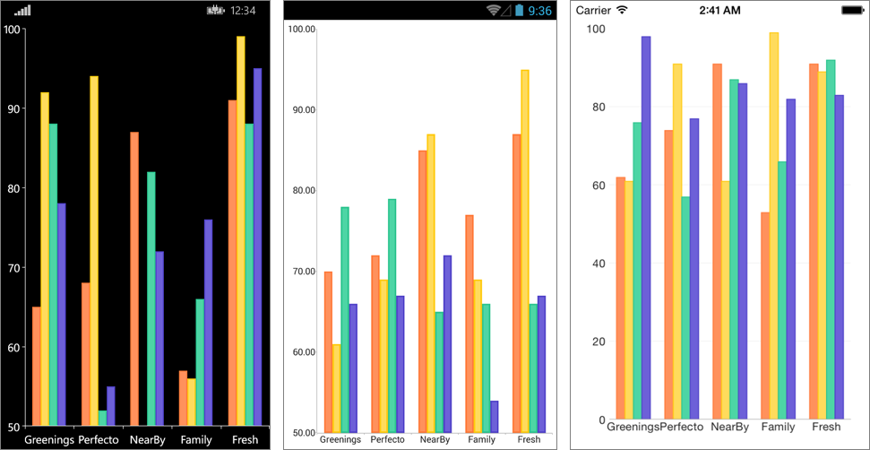

# Custom Chart Palette
When a user needs to define custom sets of colors, they can take advantage of custom palettes. Here is an example that shows how to achieve this: 

## Example

Here is an example how to create chart with custom palette:

First, create the needed business model:

<snippet id='categorical-data-model'/>

And here is the sample data used as binding context:

<snippet id='chart-customization-custompalette-viewmodel'/>

Finally, declare the RadCartesianChart in XAML or C#:

<snippet id='chart-customization-custompalette-xaml'/>
<snippet id='chart-customization-custompalette-csharp'/>

Here is the result:

## See Also

- [Categorical Series Combine Mode]()
- [Chart Legend]()
- [How To Create Custom Renderer]()
