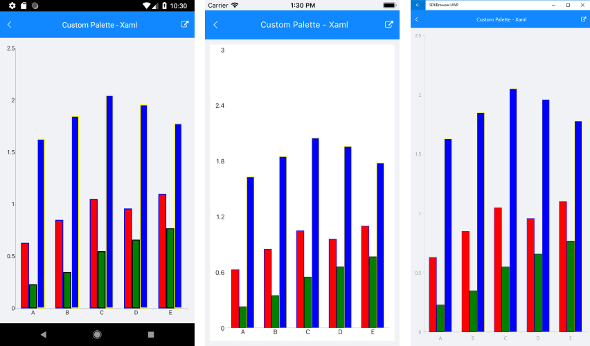

# Custom Chart Palette

When you need to define custom sets of colors for the Chart series, you can take advantage of custom palettes. RadChart exposes the following properties for setting custom ChartPalettes:

* **Palette** (of type *ChartPalette*): Defines the default appearance of the Chart series/data points.

* **SelectionPalette** (of type *ChartPalette*): Defines the appearance of the Chart series/data points when selected.

Both properties should be set to a **ChartPalette** instance. The ChartPalette holds a collection of **PaletteEntry** objects where each PaletteEntry has FillColor and StrokeColor properties, thus defining the visual appearance of each series/data points of the Chart.

>tip For SelectionPalette you'd need to add the SelectionBehavior to the ChartBehaviors collection of the Chart instance. For more details on this refer to [Chart SelectionBehavior]() topic.

## Example

Here is an example how to create a CartesianChart with custom palettes:

First, create the needed business model:

<snippet id='categorical-data-model'/>

And here is the sample data used as binding context:

<snippet id='chart-customization-custompalette-viewmodel'/>

Finally, declare the RadCartesianChart in XAML or C#:

<snippet id='chart-customization-custompalette-xaml'/>
<snippet id='chart-customization-custompalette-csharp'/>

Here is the result:

## See Also

- [Chart SelectionBehavior]()
- [Categorical Series Combine Mode]()
- [Chart Legend]()
