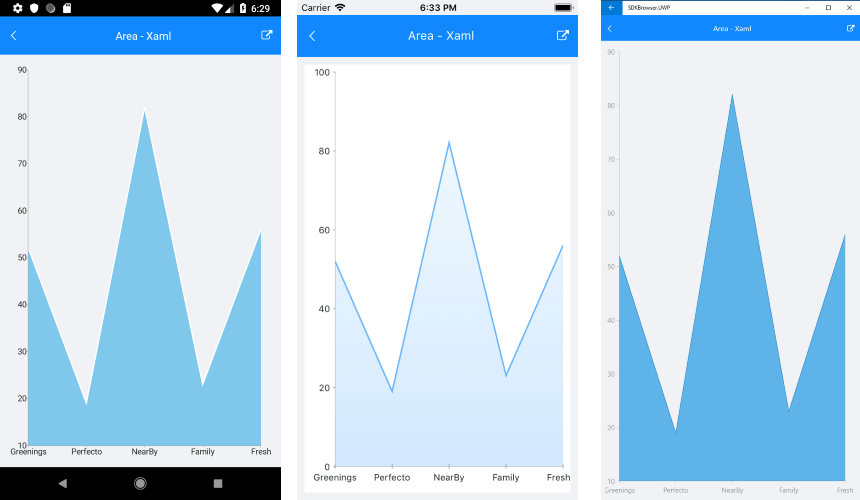
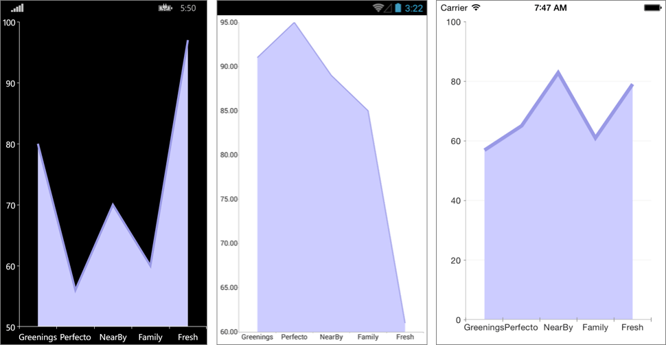

# Area Series

## Overview

**RadCartesianChart** visualizes **AreaSeries** as an area on the chart that is enclosed by the coordinate axes and straight line segments that connect the data points represented by these series. The **AreaSeries** extend **CategoricalStrokedSeries**, so they are also **CategoricalSeries** and require one **CategoricalAxis** and one **NumricalAxis**.

## Features

- **Fill** : Defines the fill of the AreaSeries.
- **Stroke** : Changes the color used to draw lines.
- **StrokeThickness** : Changes the width of the lines.

## Example

Here is an example how to create RadCartesianChart with Area Series:

First, create the needed business objects, for example:

<snippet id='categorical-data-model'/>

Then create a ViewModel:

<snippet id='chart-series-categorical-view-model'/>

Finally, use the following snippet to declare a RadCartesianChart with Area Series in XAML and in C#:

<snippet id='chart-series-area-xaml'/>
<snippet id='chart-series-area-csharp'/>

Where the **telerikChart** namespace is the following:

<snippet id='xmlns-telerikchart'/>
<snippet id='ns-telerikchart'/>

Here is the result:



### Customization Example

Here we have some customizations:
```C#
	var series = new AreaSeries 
	{ 
		Fill = new Color(0.8, 0.8, 1),
		Stroke = new Color(0.6, 0.6, 0.9), 
		StrokeThickness = 5
	};
```

This is the final result:



>important A sample Ares Series example can be found in the Chart/Series folder of the [SDK Samples Browser application]().

## See Also

- [Bar Series]()
- [Line Series]()
- [Spline Series]()