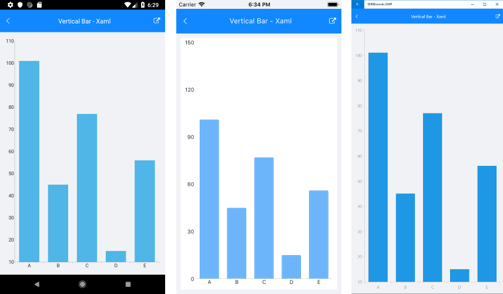

# BarSeries

## Overview

**RadCartesianChart** visualizes each data point from the **BarSeries** as a rectangle. These rectangles (or bars) can be displayed either horizontally, or vertically, depending on whether the **CategoricalAxis** is the vertical axis or the horizontal. When the horizontal axis is categorical, the rectangles are displayed vertically. This means that they have equal width while their height represents the numerical value of each of the data points. On the other hand, when the vertical axis is categorical, the rectangles have equal height, while their width represents the value of the data point. 

The **BarSeries** inherits from **CategoricalSeries** and requires one **CategoricalAxis** and one **NumericalAxis**. 

>tip You could check the common CategoricalSeries features that are also applicable to **BarSeries** at the following link: [Series Features]().

## Example

Here is an example of how to create a basic RadCartesianChart with BarSeries in XAML and C#:

<snippet id='chart-getting-started-xaml-chart'/>
<snippet id='chart-getting-started-csharp-chart'/> 

Add the following namespaces:

<snippet id='xmlns-telerikchart'/>
<snippet id='ns-telerikchart'/>

Lets create a simple data that will be used as binding context:

<snippet id='chart-getting-started-viewmodel'/>

And define the business model:

<snippet id='categorical-data-model'/>

And here is the result:

## BarSeries Palette Mode

The **Palette Mode** property of the BarSeries allows users to change the color of the series using **SeriesPaletteMode** enumeration. The changes of the color can be set on: 

- **Series**: The palette is applied to data point depending on the index of the owning ChartSeries instance. 
- **DataPoint**: You can apply the palette to the data points depending on the index od each data point. 

The fill of the BarSeries can be defined using the **FillColor** property.

### PaletteMode Example

Here is an example that demonstrates how you can set the PaletteMode property on Series and DataPoint:

<snippet id='chart-customization-palettemode-xaml'>
<snippet id='chart-customization-palettemode-csharp'>

#### PaletteMode for Series

#### PaletteMode for DataPoint

>important **SDK Browser** application contains an example that shows Palette Mode feature for BarSeries in RadChart cotrol. You can find the application in the **Examples** folder of your local **Telerik UI for Xamarin** installation.

## See Also

- [Categorical Series Overview]()
- [Categorical Series Orientation]()
- [Cartegorical Series Combine Mode]()
