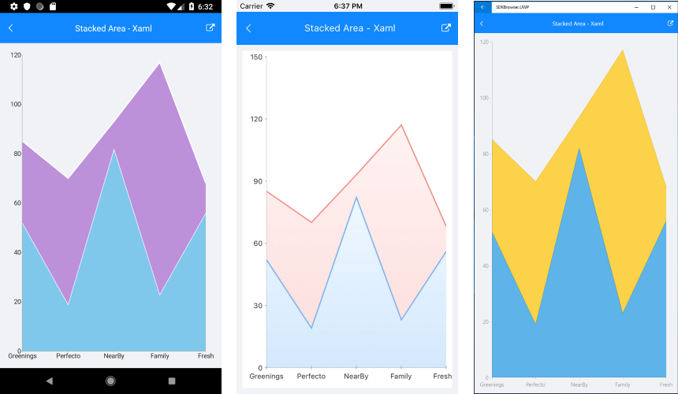

# Combine Mode

When the series in a RadCartesianChart are more than one, a few different drawing strategies can be used. The possible strategies are:

- **None**: The series are not combined - each series is plotted independently.
- **Cluster**: Series are combined next to each other (applicable for BarSeries).
- **Stack**: Series form stacks.
- **Stack100**: Series form stacks that occupy 100% of the plot area and the characterictic size of each series is proportional to its relative value.

The default combine mode is **None**. You can define the current combine mode with the series **CombineMode** property.

>note CombineMode could be applied only to Categorical Series, such as Bar, Line and Area.

## Stack Bar Series Example

Here is an example how to create Stack CartesianChart with Bar Series :

First, create the needed business objects, for example:

<snippet id='categorical-data-model'/>

Then create a ViewModel:

<snippet id='chart-series-series-categorical-view-model'/>

Finally, use the following snippet to declare a CombineMode property to the Bar Series in XAML and in C#:

<snippet id='chart-series-stackbarvertical-xaml'/>
<snippet id='chart-series-stackbarvertical-csharp'/>

Where the **telerikChart** namespace is the following:

<snippet id='xmlns-telerikchart'/>
<snippet id='ns-telerikchart'/>

Here is how Stack Bar Series looks:

>important A sample StackBarSeries example can be found in the Chart/Series folder of the [SDK Samples Browser application]().

## Stack Area Series Example

Here is how Stack Area Series looks:

>important A sample StackAreaSeries example can be found in the Chart/Series folder of the [SDK Samples Browser application]().

## Stack Spline Area Series Example

Here is how Stack Spline Area Series looks:

>important A sample StackSplineSeries example can be found in the Chart/Series folder of the [SDK Samples Browser application]().

## See Also

- [CartesianChart Orientation]()
