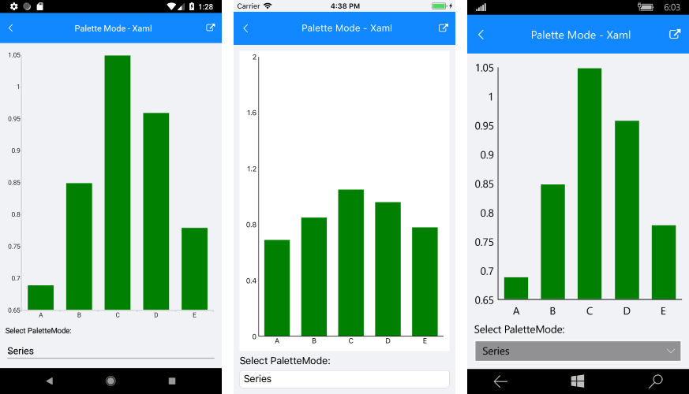
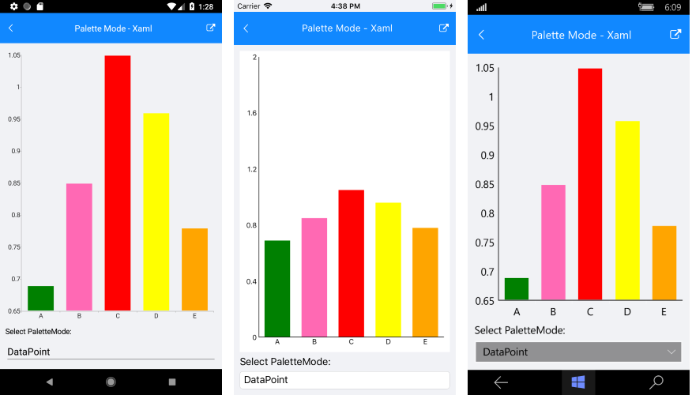

# CartegoricalSeries PaletteMode #

The **PaletteMode** property of the RadCartesianChart allows useres to change the color of the series using **SeriesPaletteMode** enumeration. You can set the changes of the color on:

- **Series**: The palette is applied to data point depending on the index of the owning ChartSeries instance. 
- **DataPoin**: You can apply the palette to the data points depending on the index od each data point. 

The **FillColor** property is used to define the fill of the series.

# Example #
Here is an example that demonstrates how you can create BarSeries that are using PaletteMode property for Series and DataPoint:
<snippet id='chart-customization-palettemode-xaml'/>
<snippet id='chart-customization-palettemode-csharp'/>

##### PaletteMode for Series #####

##### PaletteMode for DataPoint #####

>important **SDK Browser** application contains an example that shows Palette Mode feature in RadChart control. You can find the application in the **Examples** folder of your local **Telerik UI for Xamarin** installation.
