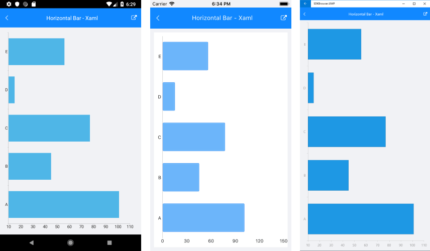
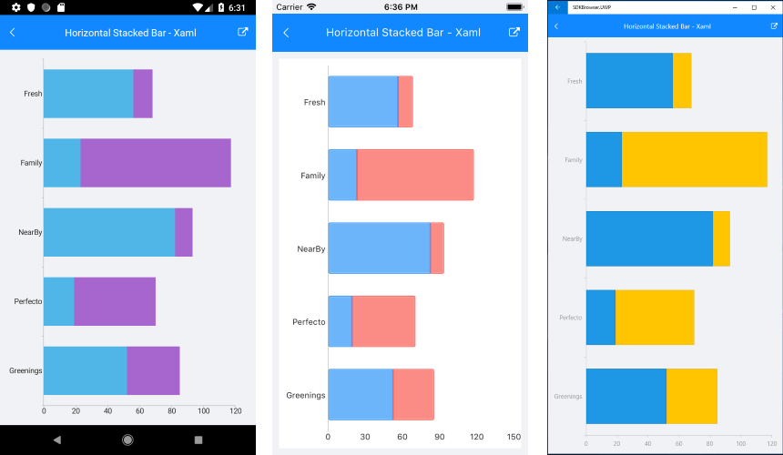

# Orientation

The orientation of the series depends on which chart axis is horizontal and which one is vertical. 

>note Orientation property could be applied only to CategoricalSeries, such as Bar, Line and Area.

## Horizontal BarSeries Example

Here is an example how to create RadCartesianChart with vertical CategoricalAxis and Horizontal Bar Series:

First, create the needed business objects, for example:

<snippet id='categorical-data-model'/>

Then create a ViewModel:

<snippet id='chart-series-categorical-data-view-model'/>

Finally, use the following snippet to declare a RadCartesianChart with Bar Series in XAML and in C#:

<snippet id='chart-series-barhorizontal-xaml'/>
<snippet id='chart-series-barhorizontal-csharp'/>

Where the **telerikChart** namespace is the following:

<snippet id='xmlns-telerikchart'/>
<snippet id='ns-telerikchart'/>

Here is the result:

>important A sample Horizontal Bar Series example can be found in the Chart/Series folder of the [SDK Samples Browser application]().

## Horizontal Stack BarSeries Example

Here is an example how to create RadCartesianChart with vertical CategoricalAxis and Stack Horizontal Bar Series:

First, create the needed business objects, for example:

<snippet id='categorical-data-model'/>

Then create a ViewModel:

<snippet id='chart-series-series-categorical-view-model'/>

Finally, use the following snippet to declare a RadCartesianChart with Bar Series in XAML and in C#:

<snippet id='chart-series-stackbarhorizontal-xaml'/>
<snippet id='chart-series-stackbarhorizontal-csharp'/>

Where the **telerikChart** namespace is the following:

<snippet id='xmlns-telerikchart'/>
<snippet id='ns-telerikchart'/>

Here is the result:

>important A sample Stack Horizontal Bar Series example can be found in the Chart/Series folder of the [SDK Samples Browser application]().

## See Also

- [CartesianChart Combine Mode]()
