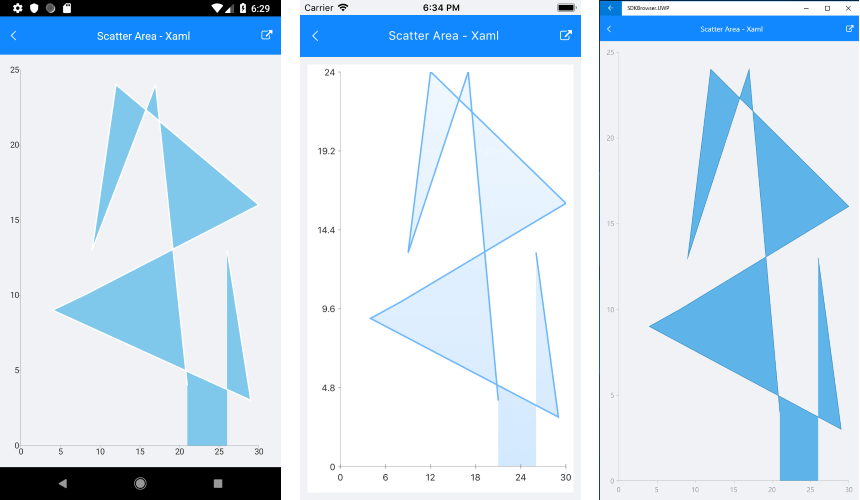

# ScatterAreaSeries

## Overview

**RadCartesianChart** visualizes **ScatterAreaSeries** as the area enclosed by the coordinate axes and straight line segments that connect the series data points. The **ScatterAreaSeries** inherit from the **[ScatterPointSeries]()** class and also require both axes of the chart to be of type **NumericalAxis**.

## Features

**ScatterAreaSeries** provides the following properties to change its style:

- **Stroke** (Color): Changes the color used to draw lines.
- **StrokeThickness** (double): Changes the width of the lines.
- **Fill** (Color): Changes the color of the chart area.

## Example

Here is an example how to create RadCartesianChart with ScatterArea Series:

First, create the needed business objects, for example:

<snippet id='numerical-data-model'/>

Then create a ViewModel:

<snippet id='chart-series-numerical-view-model'/>

Finally, use the following snippet to declare a RadCartesianChart with ScatterArea Series in XAML and in C#:

<snippet id='chart-series-scatterarea-xaml'/>
<snippet id='chart-series-scatterarea-csharp'/>

Where the **telerikChart** namespace is the following:

<snippet id='xmlns-telerikchart'/>
<snippet id='ns-telerikchart'/>

And here is the result:



>important A sample ScatterArea Series example can be found in the Chart/Series folder of the [SDK Samples Browser application]().

### Customization Example

Here we make some customization:
```C#
	var series = new ScatterAreaSeries 
	{ 
		Stroke = new Color(0.6, 0.6, 0.9), 
		StrokeThickness = 5, 
		Fill = new Color(0.8, 0.8, 1) 
	};
```

## See Also

- [Line Series]()
- [ScatterLine Series]()
- [ScatterPoint Series]()