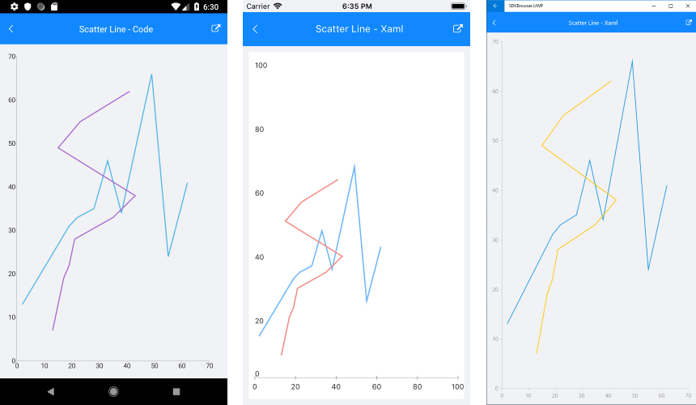

# ScatterLine Series

## Overview

The **ScatterLineSeries** are represented on the chart as data points connected with straight line segments. The **ScatterLineSeries** inherit from the **[ScatterPointSeries]()** class and also require both axes of the chart to be of type **NumericalAxis**.

## Features

**ScatterLineSeries** provide the following properties to change their style:

- **Stroke** (Color): changes the color used to draw lines.
- **StrokeThickness** (double): changes the width of the lines.

## Example

Here is an example how to create RadCartesianChart with ScatterLine Series:

First, create the needed business objects, for example:

<snippet id='numerical-data-model'/>

Then create a ViewModel:

<snippet id='chart-series-series-numerical-view-model'/>

Finally, use the following snippet to declare a RadCartesianChart with ScatterLine Series in XAML and in C#:

<snippet id='chart-series-scatterline-xaml'/>
<snippet id='chart-series-scatterline-csharp'/>

Where the **telerikChart** namespace is the following:

<snippet id='xmlns-telerikchart'/>
<snippet id='ns-telerikchart'/>

And here is the result:



>important A sample ScatterLine Series example can be found in the Chart/Series folder of the [SDK Samples Browser application]().

### Customization Example

Here we make some customizations on the ScatterLine Series applying `Stroke` and `StrokeThickness` to the series. We extended the example above:

```XAML
<telerikChart:RadCartesianChart>
    <telerikChart:RadCartesianChart.BindingContext>
        <local:SeriesNumericalViewModel />
    </telerikChart:RadCartesianChart.BindingContext>
    <telerikChart:RadCartesianChart.HorizontalAxis>
        <telerikChart:NumericalAxis LabelFitMode="MultiLine" />
    </telerikChart:RadCartesianChart.HorizontalAxis>
    <telerikChart:RadCartesianChart.VerticalAxis>
        <telerikChart:NumericalAxis />
    </telerikChart:RadCartesianChart.VerticalAxis>
    <telerikChart:RadCartesianChart.Series>
        <telerikChart:ScatterLineSeries XValueBinding="XData"
                                        YValueBinding="YData"
                                        Stroke="Red"
                                        StrokeThickness="5"
                                        ItemsSource="{Binding Data1}" />
        <telerikChart:ScatterLineSeries XValueBinding="XData"
                                        YValueBinding="YData"
                                        Stroke="Blue"
                                        StrokeThickness="5"
                                        ItemsSource="{Binding Data2}" />
    </telerikChart:RadCartesianChart.Series>
</telerikChart:RadCartesianChart>
```

Here is the result:


## See Also

- [Line Series]()
- [ScatterPoint Series]()
- [Spline Series]()
