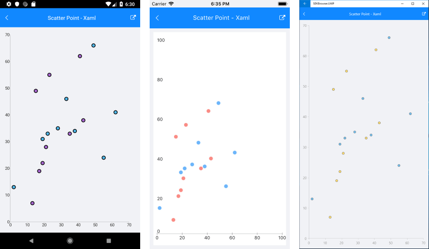

# ScatterPoint Series

## Overview

The **ScatterPointSeries** are represented on the chart as not connected data points. Each scatter data point has to provide values for the X and Y coordinate on the **RadCartesianChart**. The **ScatterPointSeries** require both axes of the chart to be of type **NumericalAxis**.

## Features

- **XValueBinding** : Defines the binding that will be used to fill the XValue of ScatterDataPoint members of the DataPoints collection.
- **YValueBinding** : Defines the binding that will be used to fill the YValue of ScatterDataPoint members of the DataPoints collection.

## Example

Here is an example how to create RadCartesianChart with ScatterPoint Series:

First, create the needed business objects, for example:

<snippet id='numerical-data-model'/>

Then create a ViewModel:

<snippet id='chart-series-series-numerical-view-model'/>

Finally, use the following snippet to declare a RadCartesianChart with ScatterPoint Series in XAML and in C#:

<snippet id='chart-series-scatterpoint-xaml'/>
<snippet id='chart-series-scatterpoint-csharp'/>

Where the **telerikChart** namespace is the following:

<snippet id='xmlns-telerikchart'/>
<snippet id='ns-telerikchart'/>

And here is the result:

>important A sample ScatterPoint Series example can be found in the Chart/Series folder of the [SDK Samples Browser application]().

## See Also

- [Line Series]()
- [ScatterLine Series]()
- [Spline Series]()
