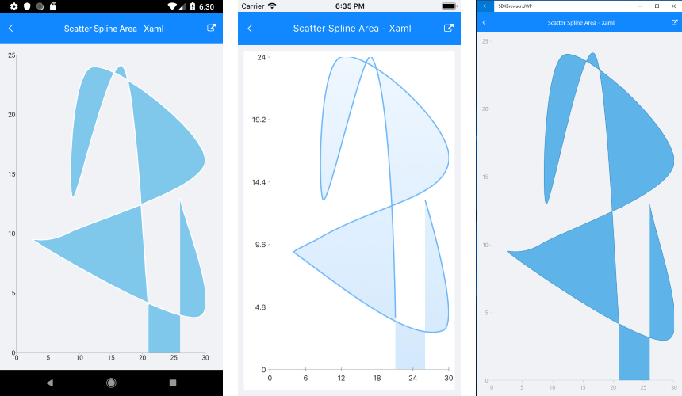

# ScatterSplineArea Series

## Overview

**RadCartesianChart** visualizes **ScatterSplineAreaSeries** as the area enclosed by the coordinate axes and curved line segments that connect the series data points. The **ScatterSplineAreaSeries** inherit from the [**ScatterPointSeries**]() class and also require both axes of the chart to be of type **NumericalAxis**.

## Features

- **XValueBinding** : Defines the binding that will be used to fill the XValue of ScatterDataPoint members of the DataPoints collection.
- **YValueBinding** : Defines the binding that will be used to fill the YValue of ScatterDataPoint members of the DataPoints collection.
- **Stroke** (Color): Changes the color used to draw lines.
- **StrokeThickness** (double): Changes the width of the lines.
- **Fill** (Color): Changes the color used to fill the area shapes.
 
## Example

Here is an example how to create RadCartesianChart with ScatterSplineArea Series:

First, create the needed business objects, for example:

<snippet id='numerical-data-model'/>

Then create a ViewModel:

<snippet id='chart-series-numerica-view-model'/>

Finally, use the following snippet to declare a RadCartesianChart with ScatterSplineArea Series in XAML and in C#:

<snippet id='chart-series-scattersplinearea-xaml'/>
<snippet id='chart-series-scattersplinearea-csharp'/>

Where the **telerikChart** namespace is the following:

<snippet id='xmlns-telerikchart'/>
<snippet id='ns-telerikchart'/>

And here is the result:



>important A sample ScatterSplineArea Series example can be found in the Chart/Series folder of the [SDK Samples Browser application]().

### Customization Example

Here we make some customization:
```C#
	var series = new ScatterSplineAreaSeries 
	{ 
		Stroke = new Color(0.6, 0.6, 0.9), 
		StrokeThickness = 5, 
		Fill = new Color(0.8, 0.8, 1) 
	};
```

## See Also

- [Line Series]()
- [ScatterLine Series]()
- [Spline Series]()
