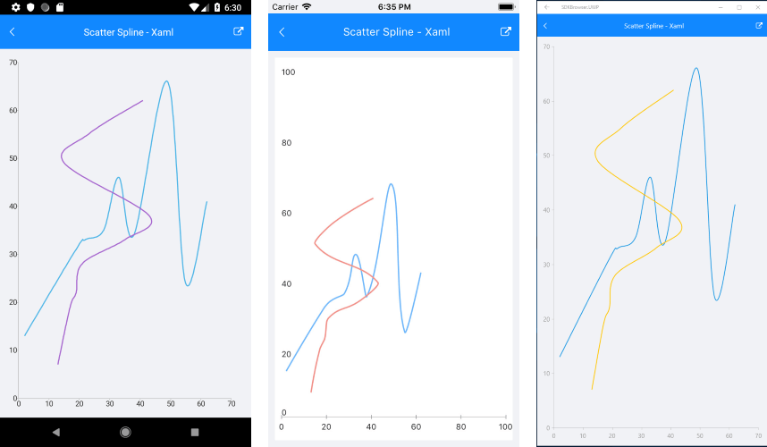

# ScatterSplineSeries #

## Overview ##

The **ScatterSplineSeries** are represented on the chart as data points connected with curved line segments. The **ScatterSplineSeries** inherit from the[**ScatterPointSeries**]() class and also require both axes of the chart to be of type **NumericalAxis**.

## Features ##

- **Stroke** (Color): changes the color used to draw lines.
- **StrokeThickness** (double): changes the width of the lines.


## Example ##

Here is an example how to create RadCartesianChart with ScatterSpline Series:

First, create the needed business objects, for example:

<snippet id='numerical-data-model'/>

Then create a ViewModel:

<snippet id='chart-series-series-numerical-view-model'/>

Finally, use the following snippet to declare a RadCartesianChart with ScatterSpline Series in XAML and in C#:

<snippet id='chart-series-scatterspline-xaml'/>
<snippet id='chart-series-scatterspline-csharp'/>

Where the **telerikChart** namespace is the following:

<snippet id='xmlns-telerikchart'/>
<snippet id='ns-telerikchart'/>

And here is the result:
	


>important A sample ScatterSpline Series example can be found in the Chart/Series folder of the [SDK Samples Browser application]().

### Customization Example

```C#
	var series = new ScatterSplineSeries 
	{ 
		Stroke = new Color(0.6, 0.6, 0.9), 
		StrokeThickness = 5 
	};
```
## See Also

- [Line Series]()
- [ScatterLine Series]()
- [Spline Series]()
