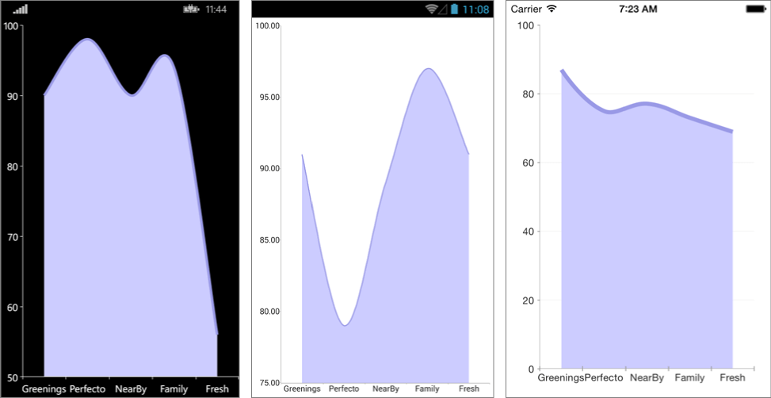

# SplineArea Series

## Overview

**RadCartesianChart** visualizes **SplineAreaSeries** as an area on the chart that is enclosed by the coordinate axes and straight line segments that connect the data points represented by these series. The **SplineAreaSeries** extend **CategoricalStrokedSeries**, so they are also **CategoricalSeries** and require one **CategoricalAxis** and one **NumricalAxis**.

## Features

- **Stroke** (Color): changes the color used to draw lines.
- **StrokeThickness** (double): changes the width of the lines.
- **Fill** (Color): changes the color used to fill the area shapes.

## Example

Here is an example how to create RadCartesianChart with SplineArea Series:

First, create the needed business objects, for example:

<snippet id='categorical-data-model'/>

Then create a ViewModel:

<snippet id='chart-series-categorical-view-model'/>

Finally, use the following snippet to declare a RadCartesianChart with SplineArea Series in XAML and in C#:

<snippet id='chart-series-splinearea-xaml'/>
<snippet id='chart-series-scatterspline-csharp'/>

Where the **telerikChart** namespace is the following:

<snippet id='xmlns-telerikchart'/>
<snippet id='ns-telerikchart'/>

And here is the result:


### Customization Example

```C#
	var series = new SplineAreaSeries 
	{ 
		Stroke = new Color(0.6, 0.6, 0.9), 
		StrokeThickness = 5, 
		Fill = new Color(0.8, 0.8, 1) 
	};
```


## See Also

- [Line Series]()
- [ScatterLine Series]()
- [Spline Series]()
